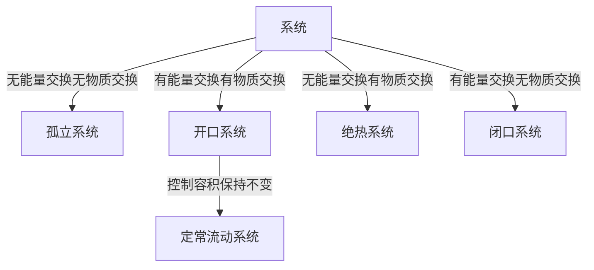

# 热工学

## 基本概念及热力学第零定律

### 系统

#### 热平衡

- 热力学第零定律：系统1和系统2达到热平衡，若系统2和系统3存在热平衡，则系统1和系统2打到热平衡。
- 热容量：对系统进行加热时，系统的温度升高，此时，系统的温度上升1K所需要的热量成为系统的热容量C（J/K）
- 比热：单位质量的热容量称为比热c(J/(KJ*K))
- 定容比热：体积一定条件下的比热成为定压比热
- 定压比热：压强一定条件下的比热成为定容比热

## 热力学第一定律

- 热力学第一定律：热和功实质上是相同的能量形式，功可以转换成热，相反，热也可以转换成功，系统内储存的能量总和，只要系统与其外界没有能量的交换就恒定不变，若与外界有能量交换，那么系统增加的或减少的能量就是其从外界释放的能量。

- 公式 $\delta$Q = $\delta$U + $\delta$W  
- Q：对外界放热or吸热，放热为负，吸热为正
- U：系统内的能量，能量增加$\delta$U为正，能量减少$\delta$U为负
- W：功，气体对外界做功为正，气体膨胀，外界对气体做功为负，气体压缩
- 焓：$H=U+PV$，焓是状态量，不是过程量，与路径无关

### 开口系统中的热力学第一定律

- 流动功W~f~: W~f~=PV，仅对于开口系统有流动功。
- 推动功为流动功的差值：$\delta$W~f~=W~f~-W~f~_0$
- 定常流动系统：控制容积不变，即$\sum_{i=0}^{n} m~1~_i$ - $\sum_{i=0}^{n} m~2~_i$,m~1~,m~2~为流入流出的质量流量
- 当流入体积为V,质量为m的工质，具有的内能为U，同时流速为w（m/s），高度为z（m），则此开口系统流入的能量为：$E_i = U + PV + \frac{m w^2}{2} + mgz$
