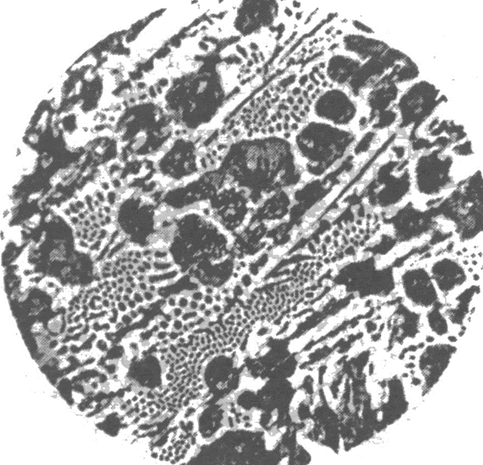
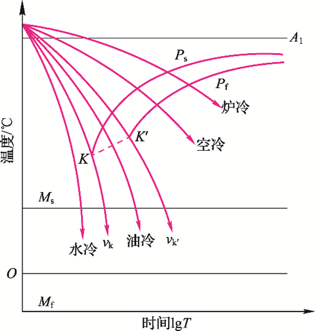

# 工程材料及成型技术基础

## 合金

### 合金基本概念

- 合金：由两种或两种以上的金属元素，或金属元素与非金属元素熔合在一起，形成具有金属特性的物质。

- 相：合金中凡是结构、成分和性能相同并且与其它部分`有界面分开`的均匀组成部分称为相。

- 组元：组成合金的独立的、最基本的单元。

- 组织：指用肉眼或借助显微镜观察到的具有某种形态特征的合金组成物。实质上它是一种或多种相按一定的方式相互结合所构成的整体的总称。它直接决定着合金的性能。——形态


### 合金的相结构

1. 固溶体:固溶体的晶格类型与其中某一组元的晶格类型相同。能保留晶格形式的组元称为固溶体的溶剂，其它组元称为溶质。

2. 金属化合物:金属化合物是各组元的原子按一定的比例相互作用生成的晶格类型和性能完全不同于任一组元，并且有一定金属性质的新相。
    例如，钢中渗碳体 ( Fe~3~C ) 是铁原子和碳原子所组成的`金属化合物`。


#### 金属的晶体缺陷


## 铁碳合金相图

铁碳合金是以铁和碳为基本组元组成的合金，是钢和铸铁的统称。

### 铁碳合金的基本相

1. 铁素体(*F* / *α*):碳溶入α-Fe中的间隙固溶体称为铁素体，用“ F ”表示。它保持α-Fe 的体心立方晶格。
   - 强度、硬度低，塑性、韧性好。

    | 显微组织 | 体心立方晶格 |
    |--|--|
    |  |  |

2. 奥氏体(*A* / *γ*):碳溶于γ-Fe中所形成的间隙固溶体（高温组织），保持γ-Fe的面心立方晶格。

3. 渗碳体(*Fe~3~C*):铁与碳组成的金属化合物称为渗碳体。
   - 渗碳体硬而脆，硬度很高(约800HBW)塑性几乎为零，是铁碳合金的重要强化相；
   - 渗碳体越细小，并均匀地分布在固溶体基体中，合金的力学性能越好；反之，越粗大或呈网状分布则脆性越大；
   - 渗碳体在铁碳合金中的形态可呈片状、粒状、网状、板条状；
4. 珠光体(*P*):*F*与 *Fe~3~C* 所形成的机械混合物。
   - 综合力学性能较好
5. 莱氏体(*Ld*):*A*与 *Fe~3~C* 所形成的机械混合物
    - 硬度很高,塑性很差


### 铁碳合金相图分析

分析对象


#### Fe-Fe~3~C相图

- 完整相图
    
- 简化相图

    ```mermaid
    sequenceDiagram
        participant 液相
        participant 高温固相
        participant 常温固相
        
        液相->>高温固相: 亚共析钢:L->A(奥氏体结晶)->A+F(部分奥氏体变铁素体)
        高温固相->>常温固相: 亚共析钢:A+Fe3C->P+Fe3C(奥氏体变珠光体)
        

        液相->>高温固相: 共析钢:L->A(奥氏体结晶)
        高温固相->>常温固相: 共析钢:A->P(奥氏体变珠光体)
        
        液相->>高温固相: 过共析钢:L->A(奥氏体结晶)->A+Fe3C(部分奥氏体变渗碳体)
        高温固相->>常温固相: 过共析钢:A+Fe3C->P+Fe3C(奥氏体变珠光体)

    ```

#### 铁碳合金的分类


##### 碳素钢相变过程

- 共析反应：一定温度下，一种固相同时析出两种固相的反应。

|  | 共析钢 | 亚共析钢 | 过共析钢 |
|-------|-------|-------|-------|
| 相图 |  |  |  |
| 金相组织 |  |  ||
| 实拍 |  |  ||
| 应用实例 ||||

注意事项：

- 共析钢：共析反应生成的珠光体在冷却过程中，其中的铁素体产生三次析出，生成Fe3CⅢ，但与共析的Fe3C连在一起，难以分辨。
- 亚共析钢：先析铁素体（α相）在随后的冷却过程中会析出Fe3CⅢ，但量很少可忽略。亚共析钢室温平衡组织：先析铁素体+珠光体P
- 过共析钢：从奥氏体中析出的Fe~3~C称为二次渗碳体，Fe~3~C~Ⅱ~沿奥氏体晶界呈网状析出，使材料的整体脆性加大 |

##### 白口铸铁相变过程

- 共晶反应：一定温度下，一种液相同时结晶出两种固相的反应。

|  | 共晶白口铁 | 亚共晶白口铁 | 过共晶白口铁 |
|-------|-------|-------|-------|
| 相图 |  |  |  |
| 金相组织 |  |  |  |
| 实拍 |  |  |  |

注意事项：

- 共晶白口铁
  1. 冷却过程中莱氏体中的奥氏体相析出Fe~3~C~Ⅱ~，但其依附于莱氏体中的Fe~3~C长大，不可见；
  2. 共晶白口铁室温组织：低温莱氏体Ld ’（珠光体呈粒状分布在Fe~3~C基体上）；
  3. 共晶白口铁的基体相是Fe~3~C脆性相，材料整体脆性较大，硬度较高 ；
- 亚共晶白口铁：无
- 过共晶白口铁：无

### 铁碳合金总结


## 钢的热处理

### 热处理的基本原理

- 钢的热处理:钢在固态下，采用适当方式进行`加热`、`保温`和`冷却`，以改变钢的内部组织结构，从而获得所需性能的一种工艺方法。
- 热处理的目的：提高钢的力学性能，延长零件使用寿命；消除缺陷，为后续工序做好组织准备。

### 钢在加热时的转化

- `奥氏体化`：加热到相变温度（临界温度）以上并保温一段时间，以获得均匀的奥氏体组织，这一过程称为`奥氏体化`。
- 三条相变线：共析钢A~1~，亚共析钢A~3~，过共析钢A~cm~
- 三条加热相变线（温度略低于相变线）：共析钢A~r1~，亚共析钢A~r3~，过共析钢A~rcm~
- 三天冷却相变线（温度略高于相变线）：共析钢A~c1~，亚共析钢A~c3~，过共析钢A~ccm~

    

#### 奥氏体化具体过程

以共析钢举例


#### 奥氏体晶粒度

- 随着加热温度的升高和保温时间的延长，奥氏体晶粒会不断长大。奥氏体晶粒大小用晶粒度来表示，它是评定钢加热质量的重要指标之一。
- 奥氏体晶粒大小用晶粒度来表示。晶粒度可分为8级，等级越高，晶粒越细。

##### 影响奥氏体晶粒度的因素

- 加热温度和保温时间：加热温度越高，保温时间越长，奥氏体晶粒长得越大。通常，加热温度对奥氏体晶粒长大的影响比保温时间更显著。
- 加热速度：加热温度确定后，加热速度越快，奥氏体晶粒越细小。因此，快速高温加热和短时保温是生产中常用的一种晶粒细化方法。
- 含碳量：随着奥氏体中含碳量的增加，奥氏体晶粒长大的倾向增大。但当含碳量超过某一限度时，碳会以残余渗碳体的形式存在，阻碍晶界移动，从而使晶粒长大倾向减小。
- 合金元素：若在钢中加入适量的Ti，Zr，V，Nb等元素，它们将在钢中形成高熔点的弥散碳化物和氮化物，阻碍奥氏体晶粒长大。

### 钢在冷却时的转化

- 钢经加热奥氏体化后，采用不同的方式冷却，将获得*不同的组织和性能*。
- 等温冷却：将已奥氏体化的钢迅速冷却到临界点以下的某一给定温度，进行保温，使其在该温度下发生组织转变。
- 连续冷却：将已奥氏体化的钢以某种冷却速度连续冷却，使其在临界点以下的不同温度进行组织转变。

#### 过冷奥氏体等温转变曲线


- 三种类型转变：分别是`高温珠光体转变`、`中温贝氏体转变`和`低温马氏体转变`。其中，高温珠光体转变和中温贝氏体转变属于等温转变，而低温马氏体转变则属于连续冷却转变。

##### 珠光体型转变

- 过冷奥氏体在A1～550℃时将转变为珠光体。


##### 贝氏体转变

- 过冷奥氏体在550℃~Ms时将转变为贝氏体。

| 550~350 | 350~Ms |
|-------|-------|
| 上贝氏体 | 下贝氏体 |
|  | |

#### 过冷奥氏体的连续冷却转变

连续冷却转变时，共析钢不发生贝氏体转变。




> v1=炉冷，
> v2=空冷，
> v3=油冷，
> v4=水冷（淬火），
> vk与C曲线“鼻尖”相切，表示过冷奥氏体在连续冷却途中不发生转变，而全部过冷到Ms以下。只发生马氏体转变的最小冷却速度，称为临界冷却速度。

##### 马氏体转变

碳在α-Fe中的过饱和固溶体称马氏体，用M表示。

> 马氏体的形态主要取决于其含碳量

- C%小于0.2%时，组织几乎全部是板条马氏体。
- C%大于1.0%C时几乎全部是针状马氏体.
- C%在0.2～ 1.0%之间为板条与针状的混合组织。

#### 钢

## 铸铁

### 铸铁分类

| 分类 | 碳存在形式| 性能 |
|-------|-------|-------|
| 白口铸铁 | C主要以渗碳体形态存在  | 硬而脆，很难切削加工，所以很少直接用来制造各种零件。 |
| 灰口铸铁 | C以片状石墨形式存在 | 力学性能不高，但它的生产工艺简单、价格低廉，而且还具备其它方面的特性，故在工业中应用最广。 |
| 球墨铸铁 | C以球状石墨形式存在 | 力学性能不仅较灰铸铁高，而且还可以通过热处理进一步提高。所以它在生产中常用作受力大且重要的铸件 |
| 蠕墨铸铁 | C以蠕虫状石墨形式存在 | 性能介于灰铸铁与球墨铸铁之间。 |
| 可锻铸铁 | C以团絮状石墨形式存在 | 其力学性能 (特别是韧性和塑性) 较灰铸铁高，并接近于球墨铸铁。它在薄壁复杂铸铁件中应用较多。 |

### 铸铁的石墨化

- 铸铁组织中石墨的形成过程称－铸铁的`石墨化`
- 铸铁中的碳除少量固溶于基体中外，主要以化合态的渗碳体(*Fe~3~C*)和游离态的石墨(G)两种形式存在
- *Fe~3~C*是亚稳相，在一定条件下将发生分解：
    *Fe~3~C*→3*Fe*+*C*（石墨）
- `石墨`其强度、塑性、韧性几乎为零。

#### 影响石墨化的因素

1. 化学成分影响

   - 碳和硅－强烈促进石墨化
   碳、硅含量过低，易出现白口组织，力学性能和铸造性能变差。
   碳、硅含量过高,会使石墨数量多且粗大，基体内铁素体量增多，降低铸件的性能

   - S、 Mn 、Cr、W、Mo、V等元素阻碍石墨化。
   P虽然可促进石墨化,但其含量高时易在晶界上形成硬而脆的磷共晶，降低铸铁的强度。

2. 冷却速度的影响

    - 铸件冷却缓慢，有利于碳原子的充分扩散，结晶将按Fe - G相图进行，因而促进石墨化。
    - 快冷时由于过冷度大，结晶将按 Fe-Fe3C相图进行, 不利于石墨化.
