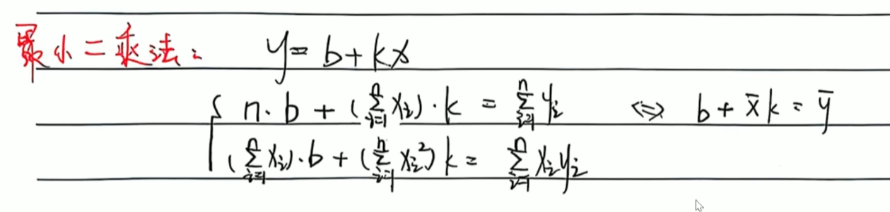

# 数值计算方法

## 误差与准确值

$p: 准确值$

p^*^: 近似值

绝对误差：$|p - p^*|$

相对误差：$\left|\frac{p - p^*}{p^*}\right|$

误差限：$|p - p^*| \leq \epsilon$
相对误差限：$\left|\frac{p - p^*}{p^*}\right| \leq \epsilon$

## 计算误差限

设估计值为：$p^*$

### 绝对误差限

那么绝对误差限 $\Delta$ 可以表示为：
$\Delta = \frac{1}{2} \times 10^{-n}$
其中，$n$ 是有效数字位数$-1$。

### 相对误差限

相对误差限 $\delta$ 可以表示为：
$\delta = \frac{\Delta}{|p|} = \frac{\frac{1}{2} \times 10^{-n}}{|p|}$
其中，$\Delta$ 是绝对误差限，$p$ 是科学计数法整数位上的值。

## 插值计算

通过有穷个点的自变量和因变量的关系，用插值公式计算出任意一点的函数值。

## 拉格朗日插值计算方法

### 拉格朗日插值公式

拉格朗日插值公式为：
\[ P(x) = \sum_{i=0}^{n} y_i \cdot L_i(x) \]
其中 \( L_i(x) \) 是拉格朗日基函数，定义为：
\[ L_i(x) = \prod_{\substack{0 \leq j \leq n \\ j \neq i}} \frac{x - x_j}{x_i - x_j} \]

### 拉格朗日基函数

拉格朗日基函数 \( L_i(x) \) 是一个 \( n \) 次的多项式，满足：
\[ L_i(x_j) = \begin{cases}
1 & \text{如果 } i = j \\
0 & \text{如果 } i \neq j
\end{cases} \]

### 计算步骤

1. **确定数据点**：给定 \( n+1 \) 个数据点 \((x_0, y_0), (x_1, y_1), \ldots, (x_n, y_n)\)。
2. **计算基函数**：对于每个数据点 \( i \)，计算拉格朗日基函数 \( L_i(x) \)。
   \[ L_i(x) = \prod_{\substack{0 \leq j \leq n \\ j \neq i}} \frac{x - x_j}{x_i - x_j} \]
3. **构造插值多项式**：使用拉格朗日基函数构造插值多项式 \( P(x) \)。
   \[ P(x) = \sum_{i=0}^{n} y_i \cdot L_i(x) \]

### 示例

假设我们有3个数据点：\((1, 1), (2, 4), (3, 9)\)。我们需要找到一个多项式 \( P(x) \) 使得 \( P(1) = 1 \)，\( P(2) = 4 \)，\( P(3) = 9 \)。

1. **确定数据点**：
   \[ (x_0, y_0) = (1, 1), \quad (x_1, y_1) = (2, 4), \quad (x_2, y_2) = (3, 9) \]

2. **计算基函数**：
   - \( L_0(x) = \frac{(x-2)(x-3)}{(1-2)(1-3)} = \frac{(x-2)(x-3)}{2} \)
   - \( L_1(x) = \frac{(x-1)(x-3)}{(2-1)(2-3)} = \frac{(x-1)(x-3)}{-1} = -(x-1)(x-3) \)
   - \( L_2(x) = \frac{(x-1)(x-2)}{(3-1)(3-2)} = \frac{(x-1)(x-2)}{2} \)

3. **构造插值多项式**：
   \[ P(x) = y_0 \cdot L_0(x) + y_1 \cdot L_1(x) + y_2 \cdot L_2(x) \]
   \[ P(x) = 1 \cdot \frac{(x-2)(x-3)}{2} + 4 \cdot -(x-1)(x-3) + 9 \cdot \frac{(x-1)(x-2)}{2} \]
   \[ P(x) = \frac{(x-2)(x-3)}{2} - 4(x-1)(x-3) + \frac{9(x-1)(x-2)}{2} \]
   \[ P(x) = \frac{x^2 - 5x + 6}{2} - 4(x^2 - 4x + 3) + \frac{9(x^2 - 3x + 2)}{2} \]
   \[ P(x) = \frac{x^2 - 5x + 6 - 8x^2 + 32x - 24 + 9x^2 - 27x + 18}{2} \]
   \[ P(x) = \frac{2x^2 - 10x + 10}{2} \]
   \[ P(x) = x^2 - 5x + 5 \]

通过这个多项式 \( P(x) = x^2 \)，我们可以看到它在给定的数据点处满足 \( P(1) = 1 \)，\( P(2) = 4 \)，\( P(3) = 9 \)。

### 总结

拉格朗日插值方法通过构造拉格朗日基函数，使得插值多项式在给定的数据点处准确地取值。（线性插值，二次插值）
同时，计算题目所求的值时，所选的点应该尽量靠近该x，比如求$P(2.5)$时，应该选取(2,4)和(3,9)这两个点，而不是(1,1)和(2,4)。
注意，当数据点数量较多时，多项式的次数会相应提高，可能导致插值误差增加（龙格现象）。

### 拉格朗日余项公式

拉格朗日余项用于估计拉格朗日插值的误差。假设 $ f(x) $ 是一个 $ n+1 $ 次可导的函数，在区间 $[a, b]$ 上，拉格朗日插值多项式 $ P_n(x) $ 在 $ x $ 处的误差 $ R_n(x) $ 可以表示为：
$ R_n(x) = f(x) - P_n(x) = \frac{f^{(n+1)}(\xi)}{(n+1)!} \prod_{i=0}^{n} (x - x_i) $
其中 $ \xi $ 是区间 $(a, b)$ 内的一个点，$ f^{(n+1)}(\xi) $ 是 $ f(x) $ 的 $ n+1 $ 阶导数在 $ \xi $ 处的值。
简单的，线性和二次的余项公式如下

## 牛顿插值计算方法

### 均差

#### 公式

#### 重要性质

### 牛顿插值公式

#### 牛顿插值多项式的一般形式

$ P(x) = f[x_0] + f[x_0,x_1](x-x_0) + f[x_0,x_1,x_2](x-x_0)(x-x_1) + \cdots + f[x_0,x_1,\ldots,x_n](x-x_0)(x-x_1)\cdots(x-x_{n-1}) $

其中，$ f[x_0], f[x_0,x_1], \ldots, f[x_0,x_1,\ldots,x_n] $ 是函数 $ f $ 在不同点的差商。（简称均差，上面那个）

#### 牛顿插值多项式的余项

牛顿插值多项式的余项（也称为截断误差），是指用牛顿插值多项式 $ P(x) $ 来近似函数 $ f(x) $ 时，两者之间的差异。余项的表达式为：

$ R(x) = f(x) - P(x) = \frac{f^{(n+1)}(\xi)}{(n+1)!}(x-x_0)(x-x_1)\cdots(x-x_n) $

其中，$ \xi $ 是某个介于 $ x_0, x_1, \ldots, x_n $ 和 $ x $ 之间的值。这个表达式表明了插值误差与函数的高阶导数以及插值点的数量有关。

## 最小二乘法（计算题目较简单）

### 相关概念公式

