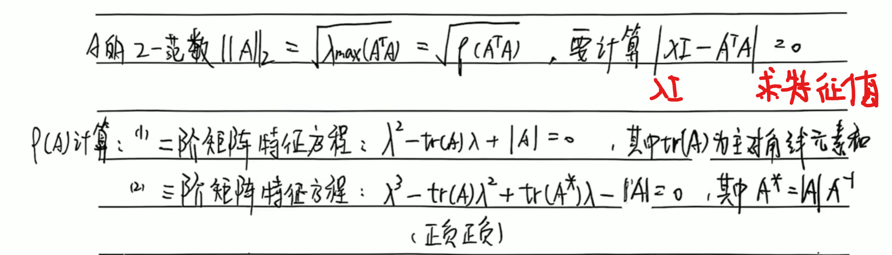
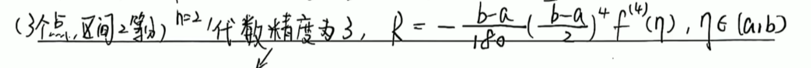
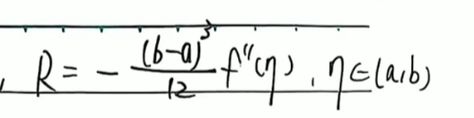
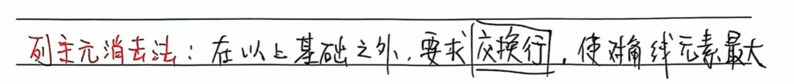
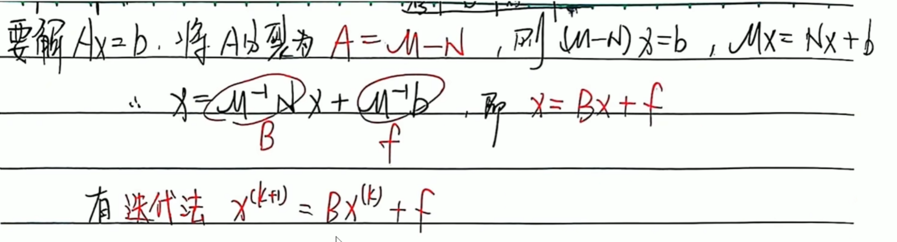

# 机械设计

## 题型总结（重点！！！）

### 计算题型

- 螺栓强度计算
- 齿轮受力及强度计算

## 机械零件的强度

### 应力比

#### 最大应力最小应力之比

- 最大应力 $σ_{max}$：在受力作用下，材料的最大应力。
- 最小应力 $σ_{min}$：在受力作用下，材料的最小应力。
- 应力比 $r = \frac{\sigma_{min}}{\sigma_{max}}$：材料的最大应力与最小应力的比值。

#### 平均应力与应力幅

- 平均应力 $\sigma_{m}$：材料的平均应力。
- 应力幅 $\sigma_{a}$：材料的应力变化幅值。

**与最大应力最小应力的关系**
$ \sigma_{max} = \sigma_{m} + \sigma_{a} $
$ \sigma_{min} = \sigma_{m} - \sigma_{a} $
$ r = \frac{\sigma_{min}}{\sigma_{max}} = \frac{\sigma_{m}}{\sigma_{m} + \sigma_{a}} $

#### 应力比的三种主要情况

| 特征 |$r=C$ | $\sigma_{m}=C$ | $\sigma_{min}=C$ |
|-------|-------|-------|-------|
| 对应实际 | 大多数转轴 | 震动弹簧 | 紧螺栓连接 |

### 接触面积定性比较

接触面积（线接触/点接触）越大，应力越小

## 磨损与润滑

### 四个摩擦状态

| --------- | 干摩擦 | 边界摩擦 | 混合摩擦 | 流体摩擦 |
|-------|-------|-------|-------|-------|
| 膜厚比$\lambda$ | 无润滑作用 | $\lambda \leq 1$ | $ 1 <\lambda \leq 3$ | $\lambda > 3$ |

### 润滑剂/润滑油脂

1. 润滑剂

    - 黏度
    - 润滑性(油性)

2. 润滑脂

    - 针入度
    - 滴点

### 形成动压油膜的三个条件

- 楔形间隙
- 大口进小口出
- 润滑油一定的黏度

## 螺纹连接

### 连接螺纹与传动螺纹分类

### 螺纹的主要参数

- 大径$d$：**公称直径**
- 小径$d_1$
- 中径$d_2$
- 线数$n$
- 螺距$P$
- 导程$P_h$
- 螺纹升角$\phi$
- 牙型角$\alpha$
- 接触高度$h$

### 螺纹连接的基本类型

| 螺纹连接类型 | 使用场合                                                                             |
| ------ | -------------------------------------------------------------------------------- |
| 螺栓连接   | 适用于连接两个带有通孔的零件，便于拆卸和安装，常用于需要**频繁拆装**的场合，如机械结构中的法兰连接、电机底座与设备支架的连接等。                   |
| 双头螺柱连接 | 适用于连接**一个较厚的零件和一个较薄的零件**，其中较厚零件难以加工通孔，双头螺柱一端拧入较厚零件的螺纹孔，另一端用螺母拧紧，常见于机器底座与混凝土基础的固定连接。 |
| 螺钉连接   | 适用场合与双头螺柱类似，但相比双头螺柱连接，螺钉连接一般用于**受力较小、不常拆卸**的场合，如机盖与机座的固定连接。                        |
| 紧定螺钉   | 用于固定轴上零件，防止其沿轴向移动，常与轴和轮毂配合使用，起到辅助固定的作用，如轴上安装的齿轮、带轮等的轴向固定。                        |

### 螺纹连接的自锁

螺纹连接的自锁条件需要满足**螺纹升角小于或等于当量摩擦角**，公式如下：

$$
 \phi \leq  \varphi = \arctan \frac{f}{\cos \beta}
$$

其中：

- \(\phi\) 为螺纹升角，计算公式为：

$$
 \phi = \arctan \frac{P_h}{\pi d_2}
$$

- \(d_2\) 是螺纹的中径。
- \(P_h\) 是螺纹的导程。

- \(\varphi\) 为当量摩擦角。
- \(f\) 是螺纹副的摩擦系数。
- \(\beta\) 牙侧角，对称牙型时牙测角\(\beta\)为\(\alpha\)的一半。

**举个例子**，常见的三角形螺纹，由于其牙型角较大，升角相对较小，通常能够满足自锁条件，所以普通螺栓连接大多采用三角形螺纹来实现自锁。

**再举个例子**，对于梯形和锯齿形螺纹来说，其牙形角较三角形螺纹小，所以当量摩擦角φv较小。不如三角形螺纹自锁性好。但是其效率较高$η=tan \phi / tan( \phi + φ)$，适合做为传动件。

### 螺纹连接的防松

### ⭐螺纹连接的强度计算

#### 松螺栓连接强度计算

$$
\sigma = \frac{F}{\frac{\pi}{4} d_1^2} \leq [\sigma]
$$

#### 紧螺栓连接强度计算

**主要参数**:

- 螺纹小径$d_1$

- 力:
  - 外部载荷$F$
  - 预紧力$F_0$
  - 残余预紧力$F_1$
  - 总拉力$F_2$:螺栓全部受力,强度计算的目标
- 形变:
  - $\lambda_b$:螺栓受预紧力$F_0$产生的形变
  - $\lambda_m$:被连接件受预紧力$F_0$产生的形变
- 刚度:
  - 螺栓刚度$C_b = \frac{F_0}{\lambda_b}$,
  - 被连接件刚度$C_m = \frac{F_0}{\lambda_m}$
  - 螺栓的相对刚度$\frac{C_b}{C_b+C_m}$
- 系数：
  - 螺栓数量$m$
  - 接合面数量$z$
  - 接合面摩擦系数$f$
  - 防滑系数$K_s$
  - 安全系数$S$

**对于横向载荷$F_v$的强度计算方法(已知横向载荷、相对刚度)**:

1. 接合面不错动条件:
   $$
   m z f F_1 \geq f
   $$

**对于轴向载荷$F_h$的强度计算方法(已知轴向载荷、相对刚度)**:

1. 计算许用应力$[\sigma]$：
2. 计算总拉力$F_2$：

   $$
   F_2 = F_0 + \frac{C_b}{C_b+C_m} F
   $$

## 带传动

基本组成：固联于主动轴上的带轮𝟏(主动轮)；固联于从动轴上的带轮𝟑(从动轮)；紧套在两轮上的传动带𝟐。

### 基本参数（初始力F0、紧边力F1、松边力F2、包角𝜶、摩擦系数𝒇）

#### 柔韧体摩擦的欧拉公式

`切记`：欧拉公式仅用于极限状态下的受力分析！

𝜶：包角（𝒓𝒂𝒅）,为小轮包角
𝒇：摩擦系数（对于𝑽带，用当量摩擦因数𝒇_𝒗代替𝒇 ）

### 力分析

#### 带传动的有效圆周力Fe

带传动的有效圆周力等于带与带轮的摩擦力，即紧边与松边的拉力差。

#### 参数间关系（最大有效拉力、初拉力、包角、摩擦因素）

#### 应力分析

带传动工作时，带中的应力有`拉应力`、`弯曲应力`、`离心拉应力`三种。

注意点：

### 失效分析（带的弹性滑动与打滑）

`弹性滑动`：带传动中因带的弹性变形变化所导致的带与带轮之间的相对运动，称为弹性滑动。
`打滑`：若带的工作载荷进一步加大，有效圆周力达到临界值𝑭_𝒆𝒄后，则带与带轮间会发生显著的相对滑动，即产生打滑。

### 设计计算(普通𝑽带传动)

大概率不考，先不看
