# 概率论与数理统计

## *考试范围*

只考概率论（1-5章）

## 事件的运算律（普通的就不提了）

### 互斥与对立

`互斥`：

- 两个或两个以上的事件不能同时发生
- 若A、B、C三个事件互斥，则 $ P(A \cup B \cup C) = P(A) + P(B) + P(C) - P(A \cap B) - P(A \cap C) - P(B \cap C) $

`对立`：

- 两个事件不能同时发生（且必定发生其中一个）

### 德摩根律

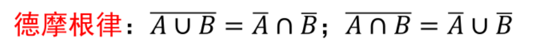

## 古典概型

### 古典概型的基本概念：等可能概型

## 条件概率

### 条件概率的公式

>乘法公式

>
>贝叶斯公式

## 事件的独立性

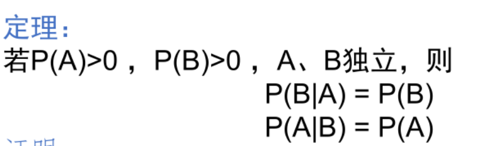

---------------------------------------------------
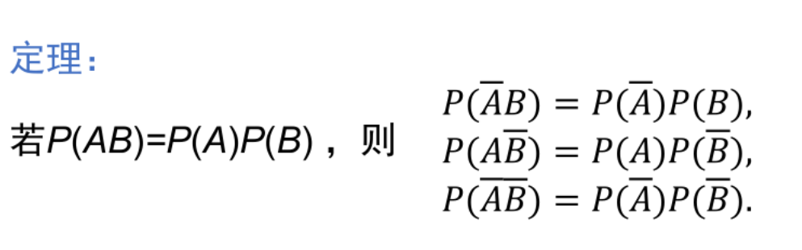

## 离散型随机变量

### 离散型随机变量的分布律

#### 0-1分布（贝努利分布）

#### 二项分布（n重伯努利试验）

>重要公式（计算每个随机变量的概率，高中学过）

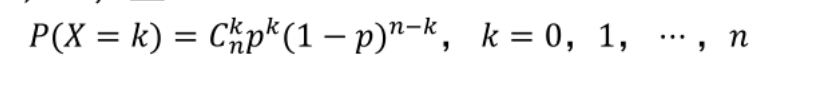

#### 泊松分布（固定范围（时间or空间）内随机事件发生的次数的分布）

>重要公式

>泊松分布的逼近定理

#### 几何分布（第一次出现事件就停止）

>重要公式
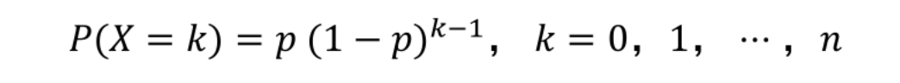

| 0-1分布 | 二项分布 | 泊松分布 | 几何分布 |
|---------|----------|----------|----------|
| \( X \sim \text{0-1} (p) \) 或 \( X \sim B (1,p) \) | \( X \sim B (n,p) \) | \( X \sim P (\lambda) \) 或 \( X \sim \pi (\lambda) \) | \( X \sim G (p) \) |
| \( p \): 成功概率 | \( n \): 试验次数，\( p \): 成功概率 | \( \lambda \): 平均事件发生率（平均次数） | \( p \): 成功概率 |

### 离散型随机变量的分布函数

## 连续型随机变量

### 连续型随机变量的定义

- 求导如果**导函数连续**，就是连续型随机变量
- 有概率密度函数一定是连续型随机变量

### 概率密度函数

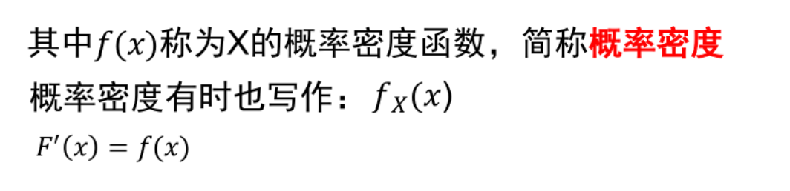

`tip`: $F(x)$为连续性随机变量函数

### 连续型随机变量的分布律

#### 均匀分布

>性质

其中可以看出，任意子区间，只要长度相同，概率就相等，**可以被算出为常数**

#### 指数分布

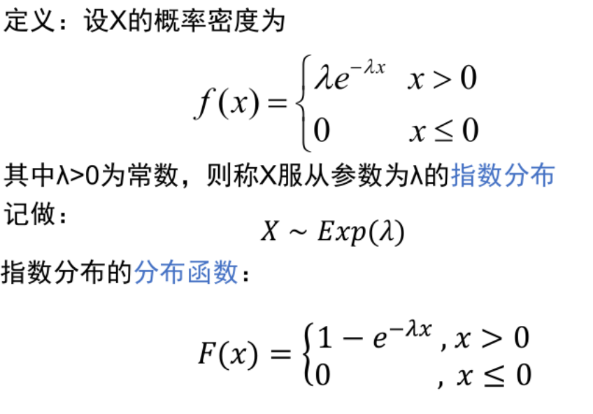

指数分布是无记忆性的，即具有恒定的概率函数

#### 正态分布

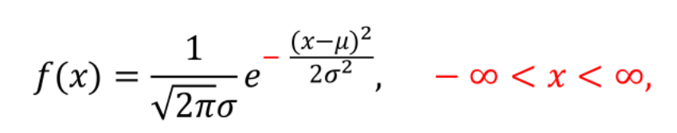

σ越小，概率越往中间集中

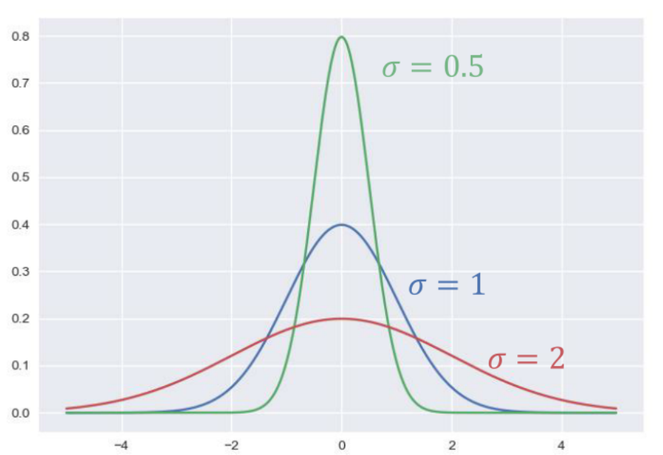

μ影响的是偏移值

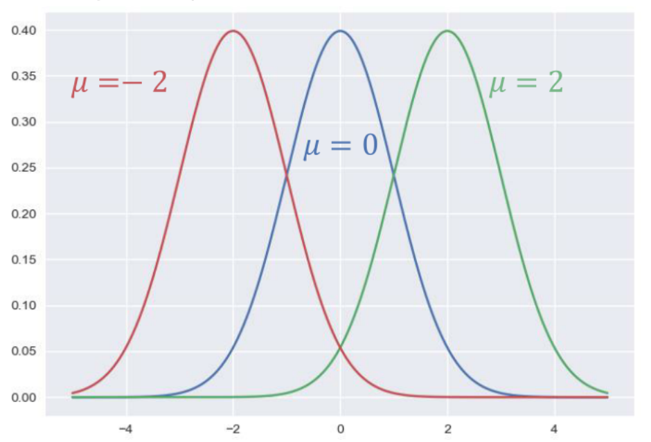

>标准正态分布
μ=0,σ=1

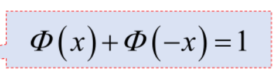

| 分布类型       | 符号表示            | 参数描述                              |
|----------------|---------------------|---------------------------------------|
| 均匀分布       | \( X \sim U (a, b) \) | \( a \): 最小值，\( b \): 最大值        |
| 指数分布       | \( X \sim exp (\lambda) \) | \( \lambda \): 平均事件发生率            |
| 正态分布       | \( X \sim N (\mu, \sigma^2) \) | \( \mu \): 均值，\( \sigma \): 标准差       |

##### 中心分布定理

二项分布的极限就是正态分布
当二项分布的n,p趋于无穷大时，可用正态分布来近似。
当二项分布的p较小时，可用指数分布来近似。

##### 非标准正态的计算

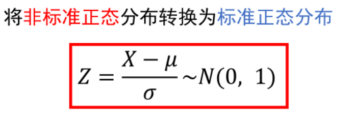

##### 已知X的概率分布函数，求Y的概率分布函数(⭐⭐⭐)

>方法一：直接求(全局通用)
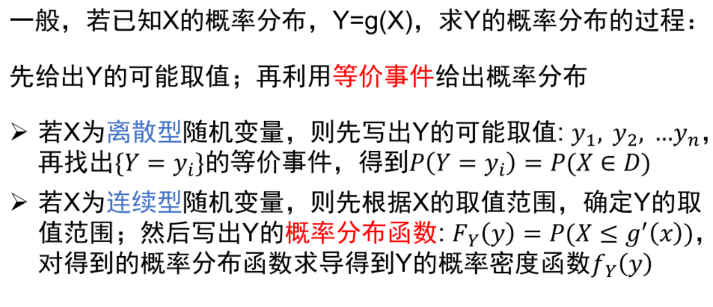
方法二：公式定理(**Y与X的关系函数一定要单调**)
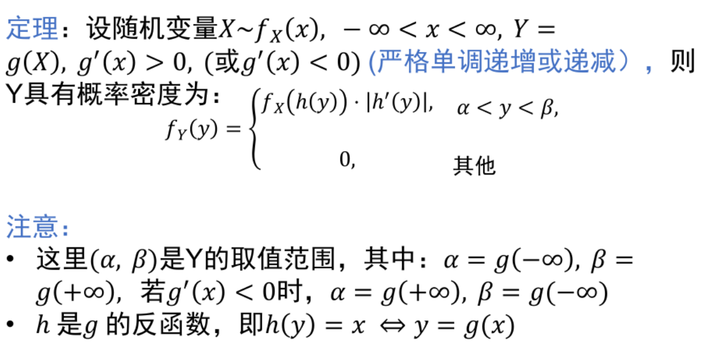

## 多维随机变量及其分布

### 二维离散型随机变量（同一维离散型，没啥区别）

变化：x -> (x,y)

#### 二维离散型随机变量的边缘分布律

#### 二维离散型随机变量的条件分布（同一维）

#### 二维离散型随机变量的分布函数（同一维）

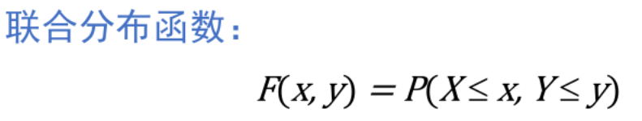

### 二维连续型随机变量

#### 二维离散型随机变量的（联合）概率密度（同一维）

后积先定限，限内划条线，先交是下限，后交是上限

#### 解题步骤

`举例`：
>
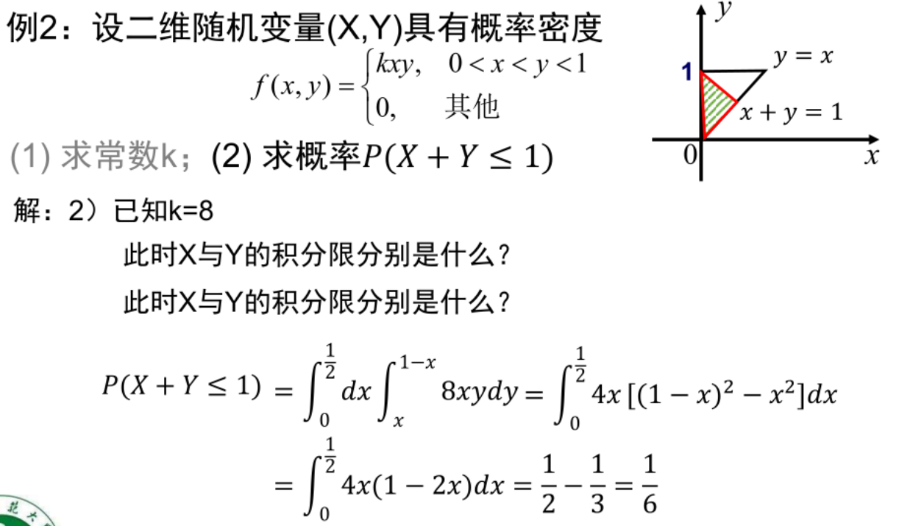

#### 二维离散型随机变量的边缘概率密度

#### 二维离散型随机变量的条件概率密度

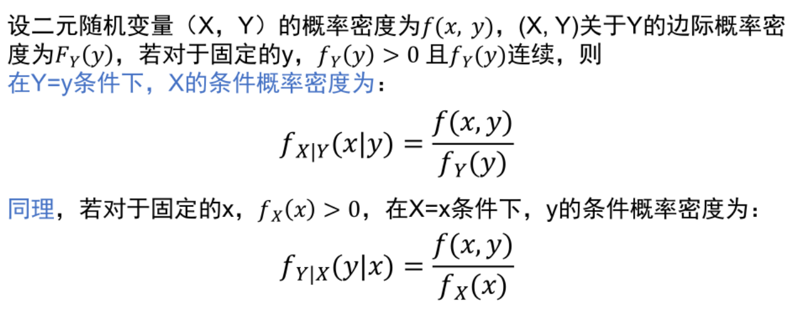

### 相互独立的二维变量

#### 定义

#### 判断

>离散型：用分布律判断

连续型：用概率密度函数判断

### 二元随机变量的分布

#### 以Z=X+Y

>离散型

连续型

**注：以上的必须建立在X与Y独立的前提条件下**
连续型更加一般的：

#### Z=max(X,Y)情况下，求Z的分布（即Z小于等于某个值，而不是Z=某个值）

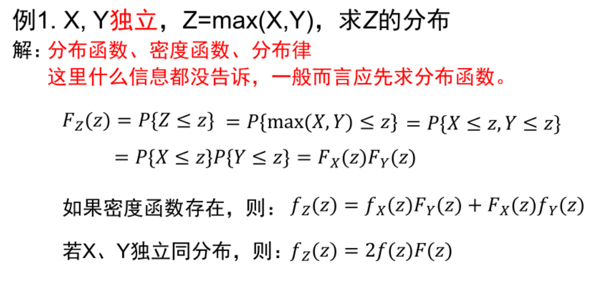

#### Z=min(X,Y)情况下，求Z的分布（即Z大于等于某个值，而不是Z=某个值）

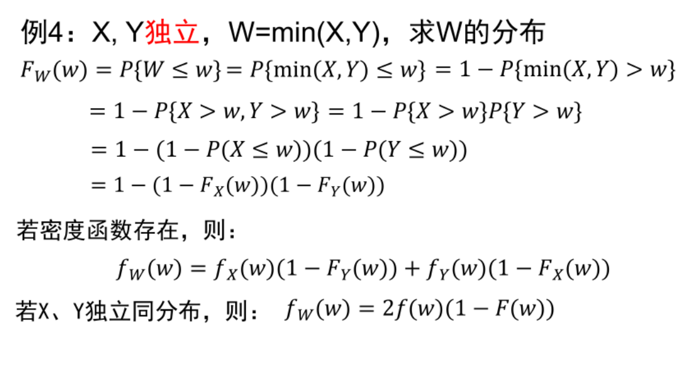

## 随机变量的数字特征

### 随机变量的数学期望

1. 离散型随机变量的数学期望
$ E(X) = \sum_{i=1}^{n} x_i \cdot p(x_i) $
其中，$ x_i $ 是随机变量 $ X $ 可能的取值，$ p(x_i) $ 是对应于 $ x_i $ 的概率，$ n $ 是所有可能取值的数量。

2. 连续型随机变量的数学期望
$ E(X) = \int_{-\infty}^{\infty} xf(x)dx $
其中，$ f(x) $ 是随机变量 $ X $ 的概率密度函数。

### 随机变量函数的数学期望

1. 离散型随机变量函数的数学期望
$ E(g(X)) = \sum_{i=1}^{n} g(x_i) \cdot p(x_i) $

2. 连续型随机变量函数的数学期望
$ E(g(X)) = \int_{-\infty}^{\infty} g(x)f(x)dx $

### 二维随机变量函数的数学期望

1. 二维离散型随机变量函数的数学期望
$ E(g(X,Y)) = \sum_{i=1}^{n} \sum_{j=1}^{m} g(x_i,y_j) \cdot p(x_i,y_j) $

2. 二维连续型随机变量函数的数学期望
$ E(g(X,Y)) = \int_{-\infty}^{\infty} \int_{-\infty}^{\infty} g(x,y)f(x,y)dxdy $

### 离散型随机变量的数学期望

1. 二项分布的数学期望（X~B(n,p)）
$ E(X) = np $

2. 泊松分布的数学期望（X~P(λ)）
$ E(X) = \lambda $

3. 几何分布的数学期望（X~G(p)）
$ E(X) = \frac{1}{p} $

### 连续型随机变量的数学期望

1. 均匀分布的数学期望（X~U(a,b)）
$ E(X) = \frac{a+b}{2} $

2. 指数分布的数学期望（X~exp(p)）
$ E(X) = \frac{1}{p} $

3. 正态分布的数学期望（X~N(μ, σ^2^)）
$ E(X) = μ $

### 随机变量的方差

1. 离散型随机变量的方差
$ Var(X) = E(X^2) - (E(X))^2 $

2. 连续型随机变量的方差
$ Var(X) = E(X^2) - (E(X))^2 $

#### 切比雪夫不等式

>定义

### 二元随机变量的方差

性质：

1. 线性性：$ Var(aX+bY) = a^2 Var(X) + b^2 Var(Y) $
2. 交换律：$ Var(X+Y) = Var(X) + Var(Y) $

    >$ Var(X + Y) = E[(X + Y - E[X + Y])^2] $
    $ = E[(X + Y - (E[X] + E[Y]))^2] $
    $ = E[(X - E[X] + Y - E[Y])^2] $
    $ = E[(X - E[X])^2 + 2(X - E[X])(Y - E[Y]) + (Y - E[Y])^2] $
    $ = E[(X - E[X])^2] + E[2(X - E[X])(Y - E[Y])] + E[(Y - E[Y])^2] $
    $ = Var(X) + 2E[(X - E[X])(Y - E[Y])] + Var(Y) $
    $ = Var(X) + Var(Y) + 2 $Cov$(X, Y) $

    **相互独立情况下**，$Cov$(X, Y) $为0

3. 齐次性：$ Var(aX) = a^2 Var(X) $

### 协方差（判断X和Y的相关性）

`定义`：
$ cov(X, Y) $
$= E([X - E(X)][Y - E(Y)]) $
$= E[XY] - E(X)E(Y) $
其中，$ E(X) $ 是 $ X $ 的期望，$ E(Y) $ 是 $ Y $ 的期望。
$ cov(X,X)=Var(X) $

`性质`：

`相关系数`:
$ ρ_(X,Y)_ = \frac{cov(X,Y)}{\sqrt{Var(X)Var(Y)}} $
>相关系数决定线性关系的强度，取值范围为-1到1，-1表示完全负相关，1表示完全正相关，0表示无相关性。

### 相关和独立的例题

总：独立一定不相关，相关不一定独立

### 大数定律

#### 伯努利大数定律（样本容量越来越大，频率逐渐逼近概率）

>定义

#### 辛钦大数定律（样本容量越来越大，样本均值逼近数学期望）

### 中心极限定律

用通俗的话来说就是，当样本容量趋于无穷大时，样本均值趋于**正态分布**的均值。

[中心极限的推导，从非标准正态分布入手](https://www.bilibili.com/video/BV14r4y1T7EN/?spm_id_from=333.337.search-card.all.click&vd_source=cf17dd0030f80c90d5c940734fca4ddc)

（非必要可不看）
