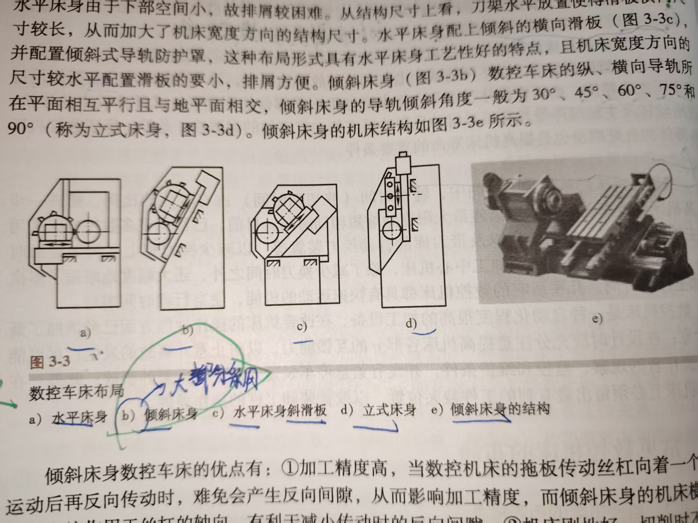

# 数控加工

> 碎碎念:1.这门课选修,不选可以不看,但看了下推荐课表,好像也就这门课不算坑?
> 2.老师没发PPT,并且PPT很多内容杂鱼.我直接用书本上的重点知识来

## 期末考题目类型

1.填空10个(20分)
2.判断10个(10分)
3.选择10个(20分)
4.名词解释(5分)  -->听老师说1,2,3,4上课听了就很简单
5.计算题(15分)  -->插补
6.编程题(30分)  -->分为两大类.数控车和铣任选一
> 1.数控车床-->考两类  
        (1)粗车循环和精车循环  
        (2)子程序
2.数控铣床 -->考两类  
        (1)加工轮廓
        (2)钻孔循环(+攻螺纹)

## 所画重点

### 第一章 绪论

#### 数控技术基本概念


#### 典型数控机床组成框图


1. 整体流程:
图样-->程序编制-->数控系统-->机床-->产品
2. 数控系统 = 数控装置 + 强电控制系统(PLC)

#### 机床的分类


> **闭环**和**半闭环**的区别在于检测装置检测了什么东西
> **闭环**:直接检测机床末端执行部件实际位置.eg.刀具位置
> **半闭环**:检测某个执行元件或者伺服传动机构中间某环节的输出.eg.电机末端

##### 数控机床坐标系(Important)

1. **数控机床坐标系**是设计,制造和使用数控机床的**基础**.
2. **数控机床坐标系**采用**右手笛卡尔直角坐标系**.
3. 常用坐标系:
   1. **机床**坐标系
      1. **参考点** != 机床坐标系**零点** ,**参考点**只是坐标系最远处
      2. 机床每次上电后首先需要回**参考点(机床零点)**,对机床坐标系进行矫正.
        > Reason:参考点和零点都固定,所以矫正时只要知道相对位移即可
   2. **工件**坐标系
      1. **可任意设置**,服务于编程的便利
      2. 由机床坐标系转变而来,一般只平移而不旋转
      3. 通过**对刀**建立**工件**坐标系和**机床**坐标系的联系
   3. **绝对**坐标系和**相对**坐标系
      1. 通过G90和G91进行转换

##### 数控机床坐标轴的确定(Improtant)

1. 定轴顺序:Z轴-->X轴-->Y轴
    > Reason:1.因为采用笛卡尔直角坐标系,所以可以使用右手定则或右手螺旋定则
    2.**好的记忆方法**
    >> **X-->Y-->Z-->X-->Y-->Z**
    **优点1**:适用与右手螺旋定则,确定两轴后,四指方向按照此顺序弯曲,大拇指方向即为另一轴正方向
    **优点2**:帮助记忆G17,G18,G19
2. Z轴

    ```mermaid
    graph LR;
        **有主轴**机床-->与主轴轴线-->远离工件or使工件尺寸增大-->正方向;

        **无主轴**机床-->与工件装夹面（即工作台面）的法线平行-->远离工件or使工件尺寸增大-->正方向;


    ```

3. X轴

    ```mermaid
    graph LR;
        **工件**旋转-->垂直于主轴轴线且平行于横向滑板-->刀具**远离**工件or工件尺寸增大-->正方向;

        **刀具**旋转-->主轴**水平**-->逆着Z轴正向由刀具（Z轴）向工件看-->正向指向右边;
        **刀具**旋转-->主轴**垂直**-->由刀具向立柱看（如立式铣床中）-->正向指向右边;


    ```

4. Y轴

确定Z轴和X轴后用右手螺旋定则即可确定

### 第二章 数控系统及工作原理

#### CNC典型组成框图


如图总结


#### 加工工序的执行

1. **五步**

    ```mermaid
    graph LR;

        译码-->数据处理-->插补-->位置控制;
        译码-->开关量控制;

    ```

    

2. 如图,数据处理又包含三步

3. 坐标变换原因:
   1. 编程时使用的是工件坐标系(对刀确定)
   2. 加工时使用的是机床坐标系
   3. 因此需要坐标变换

4. 刀具补偿处理又分三类
   1. 半径补偿(无法避免)
      使用时需要的参数
      1. 刀尖圆弧半径
      2. 车刀圆弧形状和位置:一共有八个方位角
   2. 长度补偿
   3. 位置补偿

5. 插补(Improtant)
CNC系统**核心**功能是**运动轨迹控制**,实现的根本手段是**插补**

6. 位置控制

下图是电气进给伺服系统构成和工作过程框图,采用三环控制  
位置环,速度环,电流环


#### 数控插补原理(Important)

1. **软**件实现**粗**插补,**硬**件实现**精**插补

##### 基准脉冲插补

1. 基准脉冲插补又称脉冲增量插补或行程标量插补
2. 应用较多的是逐点比较法和数字积分法
3. 只讲逐点比较法

##### 逐点比较法插补(Important)

1. 工作有四个节拍

    ```mermaid
    graph LR;

        偏差判别-->坐标进给-->偏差函数计算-->终点判别;

    ```

2. **直线**插补

3. **圆弧**插补

#### 数据补偿原理

##### 道具补偿概念

T0101 ,第一个01是刀具号,第二个01是刀补号

> 铣床中,D01是半径补偿-->一组指令[G41(左偏),G42(右偏),G40(取消半径补偿)]
> H01是长度补偿-->一组指令[G43(正偏,刀具往下),G44(负偏),G49(取消长度补偿)]

1. 刀位点
2. 刀具补偿
3. 刀补全过程
    1. 刀补建立:产生位移偏置
    2. 刀补进行:被取消前一直有效
    3. 刀补撤销


#### 位移与速度检测

本书只讲了光电式编码器

```plaintext
光栅-->物理光栅
    |
    -->计量光栅-->直线光栅
              |
              -->圆光栅
```

##### 标尺光栅

##### 指示光栅

##### 直线光栅

莫尔条纹宽度W
栅距P
两光栅齿线纹夹角θ(弧度制)
关系式:W ≈ P/θ

一个脉冲中有1/4个P,因为W上有4个光电转换器(4倍频)

##### 圆光栅

两组光栅线纹之间错开1/4个节距(θ/4)

圆光栅和指示光栅分别有一条镜像透光的狭缝z,称为**零位狭缝**

圆光栅有a相,b相和z相:
a,b相用来判断正反转
z相用来计数

#### 伺服驱动与控制

1. 执行元件有步进电机,直流伺服电机和交流伺服电机

##### 步进电机(用的少,了解)

1. 公式(用的少)

    步距角α:每给一个脉冲,转子理论上应转的角度
    定子相数m
    转子齿数z
    通电系数k

    α = 360°/mzk

2. 最高启动频率
3. 最高工作频率

2和3限制了步进电机,这俩参数超了就会丢步

##### 直流伺服电动机

1. 机械特性方程

    

2. 调节直流伺服电机转速的两种方法


蓝绿图线的交点叫基速点


##### 晶体管脉宽调制调速系统

1. 晶体管脉宽调制调速系统(简称PWM系统),通过调节占空比来调节等效电压

##### 交流伺服电机

1. 公式:

    电机转速n
    旋转磁场转速n~s~
    交流电频率f
    定子和转子极对数p

    n = n~s~ = 60f/p

   1. 因为n = n~s~,所以是同步电机(!=时是异步电机).
           同步电机精度高
   2. 因为p固定,所以变转速只能变f.此方法叫变频调速.

2. 因为自带U/f变换器,所以可用PWM改变f,从而改变转速.用的最广泛的是SPWM(正弦波脉冲宽度调制)

### 第三章

#### 数控机床的结构和性能要求(5个)

1. 高的静,动刚度及良好的抗振性能
2. 良好的热稳定性
3. 高的运动精度和低速运动的平稳性
   1. 防止低速运动的"爬行"现象
4. 高的机床寿命和精度保持性
   1. 像丝杠和导轨这种东西只能换,不能修
5. 高的效率和良好的操作性

#### 数控机床的布局



大多数采用倾斜床身

#### 数控机床的主轴传速系统及主轴组件

##### 具体要求

(1)**调速**功能(用变频器)
(2)**功率**要求
(3)**精度**要求
(4)**动态响应**要求

##### 四种传动形式

(a)带有**齿轮**的主传动
(b)通过**带传动**的主传动
(c)用**两个电机**分别驱动
(d)用**主轴电机**直接驱动


##### 数控机床主轴轴承配置形式(3种)

注:

1. 前端指离刀具近的地方(图中右侧)
2. 对前端的要求比较严格


##### 刀具自动装卸

(1)液压装夹
(2)气压装夹

#### 进给系统的机械传动机构

主要采用**丝杠**和**导轨**实现

##### 三大要求

(1)传动精度高
(2)响应速度快
(3)调速范围宽

##### 滚珠丝杠螺母副

采用**双螺母**,因为需要**双向消隙**和**加预紧力**

图(a)把左右螺母往两头撑开
图(b)把左右螺母向中间挤紧
都使双螺母作为一个整体与丝杠处于无间隙或过盈状态


##### 消除间隙和预加载荷的三种方法

(1)**垫片**消隙式
(2)**螺纹**消隙式
(3)**齿差**消隙式(挂弹簧)

### 数控机床的床身与导轨

#### 床身

1. 截面要求:**封闭腔形**结构

#### 导轨

1. **滑动**导轨
2. **滚动**导轨(最常见)
3. **静压**导轨

### 第四章(Important)

开始记代码

#### 三种加工路线

(a)行切法(粗加工)
(b)环切法(精加工)
(c)两种方法的组合(常用)


#### 外轮廓加工要求

切入和切出,避免在加工处留刀痕


#### 对刀点和换刀点的确定

1. 不是同一点
2. 对刀点在加工工件表面,换刀点要远离加工区域(可以选择在参考点进行换刀)

#### 数控加工程序格式

##### 三段

1. 程序号

   > 常用的地址码有O,P,%

2. 程序内容

3. 程序结束

   > M02和M30
   > 区别:
   > M02:回到复位状态
   > M30:回到程序开始状态


##### 程序段格式

1. N--程序**段**字号
2. G--**准备**功能字
3. X,Y,Z--**尺寸**字
4. F--**进给**功能字
5. S--**主轴转速**功能字
6. T--**刀具**功能字
7. M--**辅助**功能字

##### 习题和考试时用FANUC进行编程(做实验时用ISO标准)

目前浅显所学,GB(国标),ISO和FANUC三个标准差别不大
但数控代码不完全一样

##### G代码及其功能(MostImportant)

G00,G01,G02,G03


G04

1. 非模态
2. 用于光整


G17,G18,G19


螺纹切削
国标(GB):G33,G34,G35
FANUC:G92   (书P167)


刀具补偿
半径补偿G40,G41,G42
长度补偿G49,G43,G44(G49是取消长度补偿)


G70,G71,G72,G73(实验中用的是FANUC,跟GB不一样)
书P167

实际中
G72因效率低几乎不用
G71效率最高
要加工带凹槽的东西用G73

G70精加工(精车循环)
G71,G72,G73粗加工(粗车循环)


G90,G91
默认G90


从上图可知,不管G90/G91,只要用U,V,W.一定是增量式

国标(GB):G94,G95
默认G95

**习题和考试编程时**
FANUC:G98,G99
默认G99(书P145)


所以说这个进给量都是实践中几乎不用的每转进给

建立坐标系
G92(国标)
G50(FANUC)
> 但实际去机床加工时并未用G92/G50,因为我们是视切对刀,而不是工厂中的对刀仪对刀

1. 功能是确定工件坐标系原点与对刀点的距离
2. 只是设定坐标而不是产生运动,所以G92设定坐标前,刀具必须放在程序所要求的位置上

G00,G01,G02,G03

注:

1. G02/G03有两种格式
2. 注X,Y,Z,I,J,K,R的作用和使用方式
3. X,Y,Z:圆弧终点
4. I,J,K(增量式):圆弧起点指向圆心分别在X,Y,Z方向上的投影

详见下图


例题


G04::暂停指令

1. 非模态指令
2. 目的是使加工面光整(不留划痕)
3. 程序段格式(后面跟上X/U/P,表示)


G40,G41,G42


举例


G43,G44,G49


##### M代码及其功能


##### F,S,T代码及其功能


##### 切削用量的选择(切削三要素)

书P140
编程时关注这三要素是否都满足

1. 背吃刀量(mm),一般0.2~0.5mm
2. 主轴转速n(r/min)
3. 进给速度(进给量)f(mm/min或mm/r),一般20~50mm/min

加工精度要求高时,1要小,2要高(为了光泽),3要小

### 第五章(Important)

#### 刀具补偿

位置补偿,半径补偿,长度补偿

> 半径补偿中
> 刀具刀尖方向(8个)
> 用途:半径补偿时除了半径值R还要加一个刀具刀尖方位值T,就是这个

#### 编程指令(Important)

##### 车床代码

书P167

1. G50建立工件坐标系,对刀后将两个坐标系联系
2. G96:切削速度
3. G98,G99

4. G92螺纹循环指令
    1. 循环指令,虽然只有一个指令,但实际上干了四件事.
        下刀,加工,起刀,退刀.走一个矩形

    
    

5. G71,G72,G73

    1. 编写格式一般都采用两行的那种(一行的一般不用)
    2. G71
       1. U:进刀量(背吃刀量)
       2. R:退刀量
       3. P:精加工程序开始
       4. Q:精加工程序结束
       5. U:X轴方向精加工余量
       6. W:Z轴方向精加工余量
    3. G72(用的少)
    4. G73
       1. U:X方向加工量 = (毛坯最大D - 要加工的最小D)/2
       2. W:一般值给0
       3. R:粗车加工次数
            > 比如说U10.0,R10.那么走10刀,每刀1mm
       4. P,Q,U,W和G71一样
       5. 用于G71无法加工的凹槽处

    5. G70 精加工


##### 车床典型例题(弄明白了就超神了)

例题1

**考点:粗车+精车**


讲解:

1. 总的有N1,N2,N3,N4四段
2. N1:车刀切两刀
3. N2:
   1. G00 X67.0 Z1.0 粗车循环起点,一般粗车/精车循环起点最好是同一点
   2. 然后采用G71,并且有G42右偏,然后进行加工
   3. 最后,G28两行表示回参考点
4. N3:精车外圆
5. N4:切槽  切槽刀的刀位点在左上角(实际刀具是长方形扁刀)

例题2

**考点:子程序**


**注意**

1. 子程序用G91(增量式),如果使用G90,那么实际加工只能有效运行一次
2. 如果想要子程序进行循环,最好子程序开始点和子程序结束点把握好

例题3

**考点:精加工外形程序 + 车螺纹循环**


注:

1. 此例题没满足切削三要素,故而不完整
2. 此加工图设计了凹槽,因此需要使用G73
3. 车螺纹循环时,对于D==48,给的数值要小一点,eg.47.8(加工时刀具有挤压)
4. 车螺纹时要计算大径,中径和小径

##### 铣床

1. 可建立6个工件坐标系:G54~G59

    > 当时实验时不按照课本来,直接用厂家设置的

    

2. 图形缩放:G51,G50

    放大前后应该是同一个中心,但是为了区分放大前后的图像,所以分开画了

    

3. 图形旋转:G68,G69

    

4. 刀具半径补偿G41,G42,G40

    铣床必须要加,因为铣刀一定会有直径,车刀如果刀头尖尖的可不加

5. 孔加工循环G81

    
    
    

6. 按两大考点复习例题
