# *25下学期复习*

编写人：王浩洋，周佳豪，金陈超，赵祖安

`考试安排`：

热工与流体力学：2025-06-09(10:30-12:00)
工程材料及成型技术基础：2025-06-10(14:00-15:30)
数值计算方法：2025-06-11(08:30-10:00)
机电传动控制：2025-06-11(10:30-12:00)
机械设计：2025-06-12(10:30-12:00)
数控加工技术：2025-06-13(08:30-10:00)
概率论与数理统计：2025-06-13(10:30-12:00)
数值计算方法实验：2025-06-16(08:30-10:00)
电工与电子技术：2025-06-17(14:00-15:30)

## 流体力学


### 基本概念

流体产生力的两种方式:`粘性力`和`压力`

#### 粘性：与速度梯度成正比的“摩擦力”

- 牛顿粘性定理 $τ = μ \frac{∂u}{∂x}$
- 粘性系数 $μ$
- 运动粘度 $\nu = \frac{μ}{ρ}$

#### 压缩性：受外界压力时体积减小的容易程度

- 易压缩性 $β = - \frac{1}{V} \frac{∂V}{∂p}$
- 体积弹性模量/不易压缩性 $K = \frac{1}{β}$

##### 可压/不可压流动(压力是否即刻传导)

- 声速:物体中**传递力的最大速度**$a=\sqrt{\frac{K}{ρ}}$
- 马赫数: 流体变化**较声速的程度**$M = \frac{U}{a}$

1. 不可压缩流动:流体变化慢,**流体受压时能跑掉**(流速<<流体热运动速度即`音速` $M<0.3$ )的流动
2. 可压缩流动:流体变化快,流体受压时跑不掉(流速接近流体热运动速度即`音速` $M>0.3$ )的流动

### 流体静(流体没有形变)力学

特点:压力与质量力(重力,惯性力,电磁力)平衡

1. 静止的流体内部没有剪切力->静止的流体流体中只有压力和质量力
2. 压力与方向无关->同样深度朝任何方向的压力相同

#### 求解方法:压力和质量力平衡

- 参数:方向$x/y/z$,密度$ρ$,压强$p$
- 微分形式: $dp = ρ a_x d_x + ρ a_y d_y + ρ a_z d_z$

**特殊情况:压力和重力平衡**(即质量力只考虑重力):

- 参数:高度z,密度ρ,重力加速度g
- 微分形式(适用任意情况): $\partial p = ρ g dz$
- 常规形式: $p = ρ g z$

### 流体的运动

#### 研究方法

1. 拉格朗日法:研究质点的运动
2. 欧拉法:研究空间中定点的运动(流体力学一般使用这种)

##### 流线/迹线/脉线

- 流线:空间中每一点的速度**矢量图**
- 迹线:某质点在空间中运动的**轨迹图**,所以可相交
- 脉线:通过某固定点**质点连成的线**,也可相交

#### 流体分类

##### 定常/非定常流动

- 定常流动:$\frac{\partial \vec{V}}{\partial t} \equiv 0$
- 非定常流动:空间某定点的速度变化:$\frac{\partial \vec{V}}{\partial t} \neq 0$

##### 均匀/非均匀流动

- 均匀流动:流体在空间中任意一点的速度都相同
- 非均匀流动:流体在空间中某一点的速度不相同

##### (估计不考)涡

- 自由涡:$ v_t \propto \frac{1}{r} $
- 强制涡$ v_t \propto r $

##### 层流/湍流

###### 雷诺数

- 截面平均流速$v$,管内径$d$,运动粘度$\nu$
- 雷诺数$Re = \frac{v d}{\nu}$

1. 层流:$Re < 2300$
2. 湍流:$Re > 4000$

#### (估计不考)流体微团的运动:线变形,旋转,角变形,平动

待编写

### 流体加速度(流体压力/密度/温度的变化类比这个)

$\vec{a}=\frac{d \vec{V}}{d t} \\
=\frac{\partial \vec{V}}{\partial t}+\frac{\partial \vec{V}}{\partial x}\frac{\partial x}{\partial t}+\frac{\partial \vec{V}}{\partial y}\frac{\partial y}{\partial t} +\frac{\partial \vec{V}}{\partial z}\frac{\partial z}{\partial t}$

- 局部加速度:相对空间的加速度,定常流动当地加速度为0
  - $\frac{\partial \vec{V}}{\partial t}$
- 对流加速度:相对流体自身的加速度
  - $\frac{\partial \vec{V}}{\partial x}\frac{\partial x}{\partial t}+\frac{\partial \vec{V}}{\partial y}\frac{\partial y}{\partial t} +\frac{\partial \vec{V}}{\partial z}\frac{\partial z}{\partial t}$

例子:


#### 物质导数(流体物理量的时间变化率)

$ \frac{D }{D t} =  \frac{\partial }{\partial t} + u \frac{\partial}{\partial x}+ v \frac{\partial}{\partial y}+ w \frac{\partial}{\partial z}$

### 质量守恒

#### 准一维流动的连续方程，即质量守恒

- 准一维流动:只在一个方向上有速度变化的流动,(流管横截面积$A$变化)
- 流管横截面积$A$
- 流速$U$
- 体积流量$Q = A U$
- 控制体$CV$:研究的区域(空间中固定),质量守恒即流入和流出的体积流量相等

**连续方程:$Q_{in} = Q_{out} \\ A_{in}  U_{in} = A_{out}  U_{out}$**

## 工程材料及成型技术基础

### 合金

#### 合金基本概念

- 合金：由两种或两种以上的金属元素，或金属元素与非金属元素熔合在一起，形成具有金属特性的物质。

- 相：合金中凡是结构、成分和性能相同并且与其它部分`有界面分开`的均匀组成部分称为相。

- 组元：组成合金的独立的、最基本的单元。

- 组织：指用肉眼或借助显微镜观察到的具有某种形态特征的合金组成物。实质上它是一种或多种相按一定的方式相互结合所构成的整体的总称。它直接决定着合金的性能。——形态


#### 合金的相结构

1. 固溶体:固溶体的晶格类型与其中某一组元的晶格类型相同。能保留晶格形式的组元称为固溶体的溶剂，其它组元称为溶质。

2. 金属化合物:金属化合物是各组元的原子按一定的比例相互作用生成的晶格类型和性能完全不同于任一组元，并且有一定金属性质的新相。
    例如，钢中渗碳体 ( Fe~3~C ) 是铁原子和碳原子所组成的`金属化合物`。


#### 金属的晶体缺陷


### 铁碳合金相图

铁碳合金是以铁和碳为基本组元组成的合金，是钢和铸铁的统称。

#### 铁碳合金的基本相

1. 铁素体(*F* / *α*):碳溶入α-Fe中的间隙固溶体称为铁素体，用“ F ”表示。它保持α-Fe 的体心立方晶格。
   - 强度、硬度低，塑性、韧性好。

    | 显微组织 | 体心立方晶格 |
    |--|--|
    |  |  |

2. 奥氏体(*A* / *γ*):碳溶于γ-Fe中所形成的间隙固溶体（高温组织），保持γ-Fe的面心立方晶格。

3. 渗碳体(*Fe~3~C*):铁与碳组成的金属化合物称为渗碳体。
   - 渗碳体硬而脆，硬度很高(约800HBW)塑性几乎为零，是铁碳合金的重要强化相；
   - 渗碳体越细小，并均匀地分布在固溶体基体中，合金的力学性能越好；反之，越粗大或呈网状分布则脆性越大；
   - 渗碳体在铁碳合金中的形态可呈片状、粒状、网状、板条状；
4. 珠光体(*P*):*F*与 *Fe~3~C* 所形成的机械混合物。
   - 综合力学性能较好
5. 莱氏体(*Ld*):*A*与 *Fe~3~C* 所形成的机械混合物
    - 硬度很高,塑性很差


### 铁碳合金相图分析

分析对象
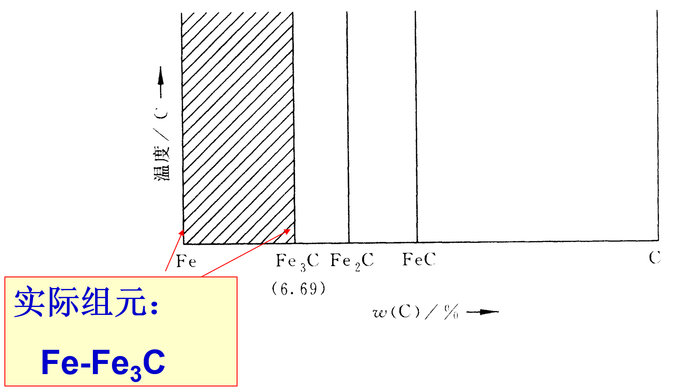

#### Fe-Fe~3~C相图

- 完整相图
    
- 简化相图

    ```mermaid
    sequenceDiagram
        participant 液相
        participant 高温固相
        participant 常温固相
        
        液相->>高温固相: 亚共析钢:L->A(奥氏体结晶)->A+F(部分奥氏体变铁素体)
        高温固相->>常温固相: 亚共析钢:A+Fe3C->P+Fe3C(奥氏体变珠光体)
        

        液相->>高温固相: 共析钢:L->A(奥氏体结晶)
        高温固相->>常温固相: 共析钢:A->P(奥氏体变珠光体)
        
        液相->>高温固相: 过共析钢:L->A(奥氏体结晶)->A+Fe3C(部分奥氏体变渗碳体)
        高温固相->>常温固相: 过共析钢:A+Fe3C->P+Fe3C(奥氏体变珠光体)

    ```

#### 铁碳合金的分类


##### 碳素钢相变过程

- 共析反应：一定温度下，一种固相同时析出两种固相的反应。

|  | 共析钢 | 亚共析钢 | 过共析钢 |
|-------|-------|-------|-------|
| 相图 | 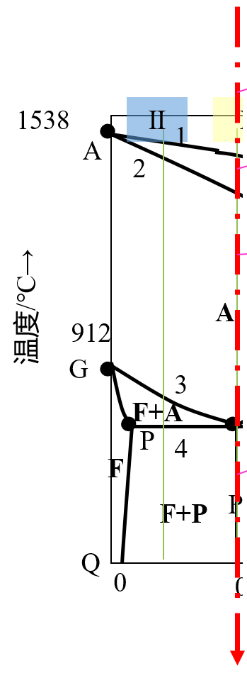 |  |  |
| 金相组织 |  | 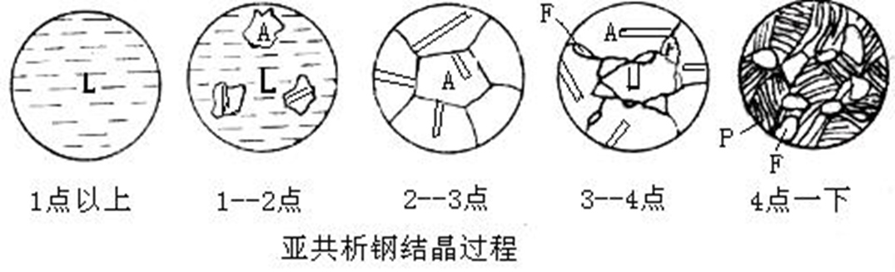 ||
| 实拍 | 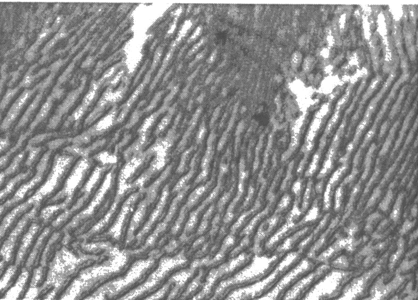 |  |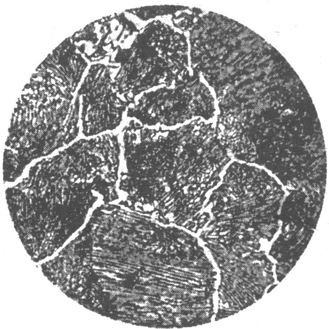|
| 应用实例 |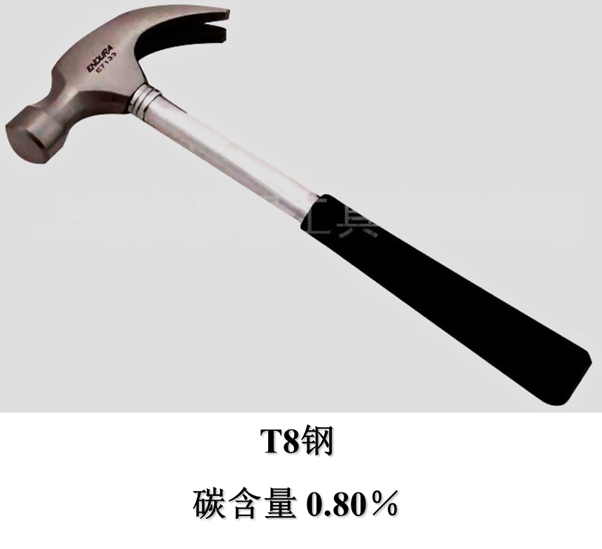|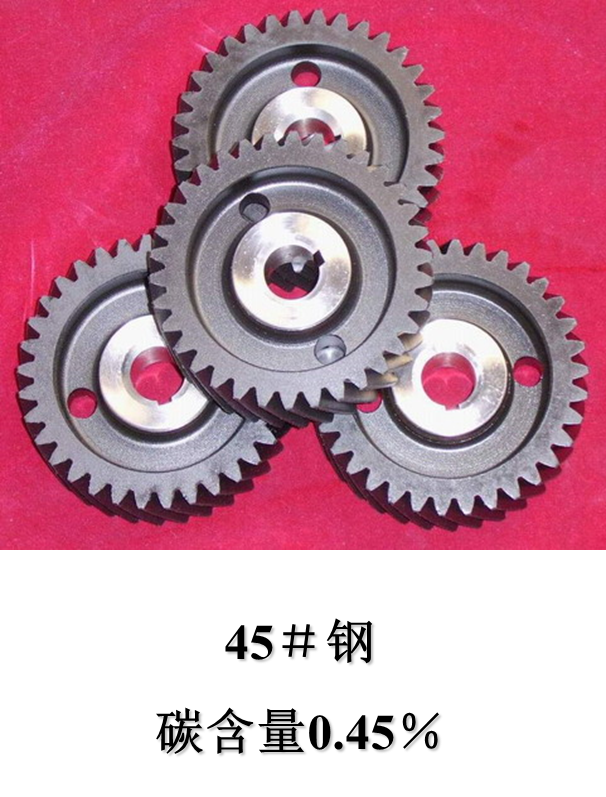||

注意事项：

- 共析钢：共析反应生成的珠光体在冷却过程中，其中的铁素体产生三次析出，生成Fe3CⅢ，但与共析的Fe3C连在一起，难以分辨。
- 亚共析钢：先析铁素体（α相）在随后的冷却过程中会析出Fe3CⅢ，但量很少可忽略。亚共析钢室温平衡组织：先析铁素体+珠光体P
- 过共析钢：从奥氏体中析出的Fe~3~C称为二次渗碳体，Fe~3~C~Ⅱ~沿奥氏体晶界呈网状析出，使材料的整体脆性加大 |

##### 白口铸铁相变过程

- 共晶反应：一定温度下，一种液相同时结晶出两种固相的反应。

|  | 共晶白口铁 | 亚共晶白口铁 | 过共晶白口铁 |
|-------|-------|-------|-------|
| 相图 |  |  |  |
| 金相组织 | 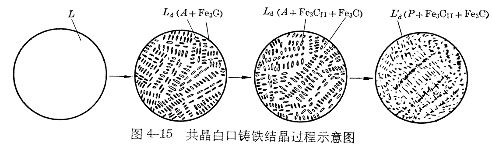 |  |  |
| 实拍 |  |  |  |

注意事项：

- 共晶白口铁
  1. 冷却过程中莱氏体中的奥氏体相析出Fe~3~C~Ⅱ~，但其依附于莱氏体中的Fe~3~C长大，不可见；
  2. 共晶白口铁室温组织：低温莱氏体Ld ’（珠光体呈粒状分布在Fe~3~C基体上）；
  3. 共晶白口铁的基体相是Fe~3~C脆性相，材料整体脆性较大，硬度较高 ；
- 亚共晶白口铁：无
- 过共晶白口铁：无

#### 铁碳合金总结


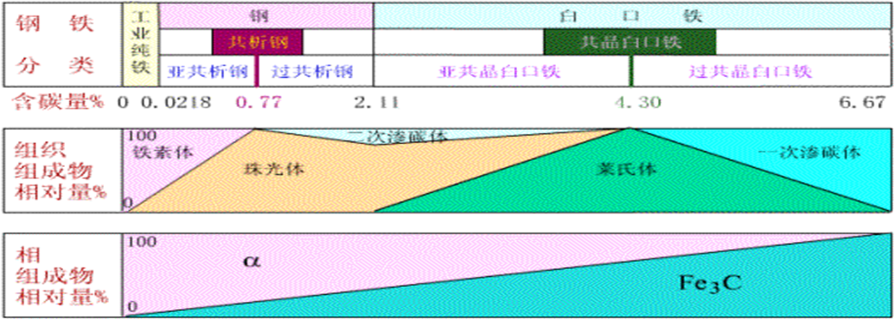

### 钢的热处理

#### 热处理的基本原理

- 钢的热处理:钢在固态下，采用适当方式进行`加热`、`保温`和`冷却`，以改变钢的内部组织结构，从而获得所需性能的一种工艺方法。
- 热处理的目的：提高钢的力学性能，延长零件使用寿命；消除缺陷，为后续工序做好组织准备。

#### 钢在加热时的转化

- `奥氏体化`：加热到相变温度（临界温度）以上并保温一段时间，以获得均匀的奥氏体组织，这一过程称为`奥氏体化`。
- 三条相变线：共析钢A~1~，亚共析钢A~3~，过共析钢A~cm~
- 三条加热相变线（温度略低于相变线）：共析钢A~r1~，亚共析钢A~r3~，过共析钢A~rcm~
- 三天冷却相变线（温度略高于相变线）：共析钢A~c1~，亚共析钢A~c3~，过共析钢A~ccm~

    

##### 奥氏体化具体过程

以共析钢举例


##### 奥氏体晶粒度

- 随着加热温度的升高和保温时间的延长，奥氏体晶粒会不断长大。奥氏体晶粒大小用晶粒度来表示，它是评定钢加热质量的重要指标之一。
- 奥氏体晶粒大小用晶粒度来表示。晶粒度可分为8级，等级越高，晶粒越细。

###### 影响奥氏体晶粒度的因素

- 加热温度和保温时间：加热温度越高，保温时间越长，奥氏体晶粒长得越大。通常，加热温度对奥氏体晶粒长大的影响比保温时间更显著。
- 加热速度：加热温度确定后，加热速度越快，奥氏体晶粒越细小。因此，快速高温加热和短时保温是生产中常用的一种晶粒细化方法。
- 含碳量：随着奥氏体中含碳量的增加，奥氏体晶粒长大的倾向增大。但当含碳量超过某一限度时，碳会以残余渗碳体的形式存在，阻碍晶界移动，从而使晶粒长大倾向减小。
- 合金元素：若在钢中加入适量的Ti，Zr，V，Nb等元素，它们将在钢中形成高熔点的弥散碳化物和氮化物，阻碍奥氏体晶粒长大。

#### 钢在冷却时的转化

- 钢经加热奥氏体化后，采用不同的方式冷却，将获得*不同的组织和性能*。
- 等温冷却：将已奥氏体化的钢迅速冷却到临界点以下的某一给定温度，进行保温，使其在该温度下发生组织转变。
- 连续冷却：将已奥氏体化的钢以某种冷却速度连续冷却，使其在临界点以下的不同温度进行组织转变。

##### 过冷奥氏体等温转变曲线

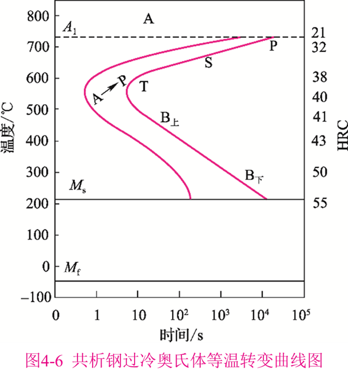

- 三种类型转变：分别是`高温珠光体转变`、`中温贝氏体转变`和`低温马氏体转变`。其中，高温珠光体转变和中温贝氏体转变属于等温转变，而低温马氏体转变则属于连续冷却转变。

###### 珠光体型转变

- 过冷奥氏体在A1～550℃时将转变为珠光体。


##### 贝氏体转变

- 过冷奥氏体在550℃~Ms时将转变为贝氏体。

| 550~350 | 350~Ms |
|-------|-------|
| 上贝氏体 | 下贝氏体 |
|  |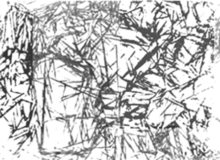 |

#### 过冷奥氏体的连续冷却转变

连续冷却转变时，共析钢不发生贝氏体转变。


> v1=炉冷，
> v2=空冷，
> v3=油冷，
> v4=水冷（淬火），
> vk与C曲线“鼻尖”相切，表示过冷奥氏体在连续冷却途中不发生转变，而全部过冷到Ms以下。只发生马氏体转变的最小冷却速度，称为临界冷却速度。

##### 马氏体转变

碳在α-Fe中的过饱和固溶体称马氏体，用M表示。

> 马氏体的形态主要取决于其含碳量

- C%小于0.2%时，组织几乎全部是板条马氏体。
- C%大于1.0%C时几乎全部是针状马氏体.
- C%在0.2～ 1.0%之间为板条与针状的混合组织。

#### 钢

### 铸铁

#### 铸铁分类

| 分类 | 碳存在形式| 性能 |
|-------|-------|-------|
| 白口铸铁 | C主要以渗碳体形态存在  | 硬而脆，很难切削加工，所以很少直接用来制造各种零件。 |
| 灰口铸铁 | C以片状石墨形式存在 | 力学性能不高，但它的生产工艺简单、价格低廉，而且还具备其它方面的特性，故在工业中应用最广。 |
| 球墨铸铁 | C以球状石墨形式存在 | 力学性能不仅较灰铸铁高，而且还可以通过热处理进一步提高。所以它在生产中常用作受力大且重要的铸件 |
| 蠕墨铸铁 | C以蠕虫状石墨形式存在 | 性能介于灰铸铁与球墨铸铁之间。 |
| 可锻铸铁 | C以团絮状石墨形式存在 | 其力学性能 (特别是韧性和塑性) 较灰铸铁高，并接近于球墨铸铁。它在薄壁复杂铸铁件中应用较多。 |

#### 铸铁的石墨化

- 铸铁组织中石墨的形成过程称－铸铁的`石墨化`
- 铸铁中的碳除少量固溶于基体中外，主要以化合态的渗碳体(*Fe~3~C*)和游离态的石墨(G)两种形式存在
- *Fe~3~C*是亚稳相，在一定条件下将发生分解：
    *Fe~3~C*→3*Fe*+*C*（石墨）
- `石墨`其强度、塑性、韧性几乎为零。

##### 影响石墨化的因素

1. 化学成分影响

   - 碳和硅－强烈促进石墨化
   碳、硅含量过低，易出现白口组织，力学性能和铸造性能变差。
   碳、硅含量过高,会使石墨数量多且粗大，基体内铁素体量增多，降低铸件的性能

   - S、 Mn 、Cr、W、Mo、V等元素阻碍石墨化。
   P虽然可促进石墨化,但其含量高时易在晶界上形成硬而脆的磷共晶，降低铸铁的强度。

2. 冷却速度的影响

    - 铸件冷却缓慢，有利于碳原子的充分扩散，结晶将按Fe - G相图进行，因而促进石墨化。
    - 快冷时由于过冷度大，结晶将按 Fe-Fe3C相图进行, 不利于石墨化.

## 数值计算方法

## 机电传动控制

### 机电传动考试题型

### 机电传动考试重点

## 机械设计

### 题型总结（重点！！！）

#### 计算题型

##### 螺栓强度计算

##### 齿轮受力及强度计算

### 螺纹连接和螺旋传动

### 带传动

基本组成：固联于主动轴上的带轮𝟏(主动轮)；固联于从动轴上的带轮𝟑(从动轮)；紧套在两轮上的传动带𝟐。


#### 基本参数（初始力F0、紧边力F1、松边力F2、包角𝜶、摩擦系数𝒇）

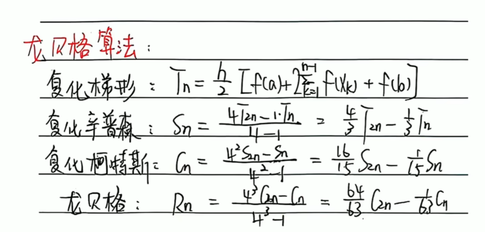
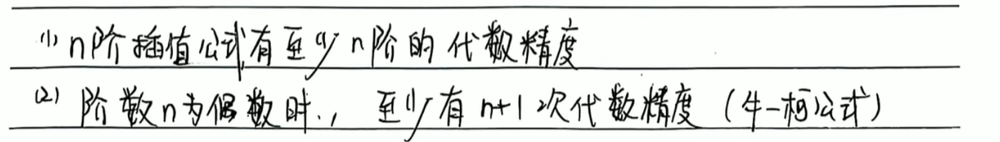

##### 柔韧体摩擦的欧拉公式

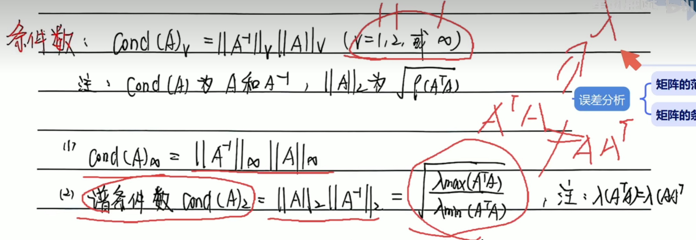

`切记`：欧拉公式仅用于极限状态下的受力分析！

𝜶：包角（𝒓𝒂𝒅）,为小轮包角
𝒇：摩擦系数（对于𝑽带，用当量摩擦因数𝒇_𝒗代替𝒇 ）


#### 力分析

##### 带传动的有效圆周力Fe

带传动的有效圆周力等于带与带轮的摩擦力，即紧边与松边的拉力差。

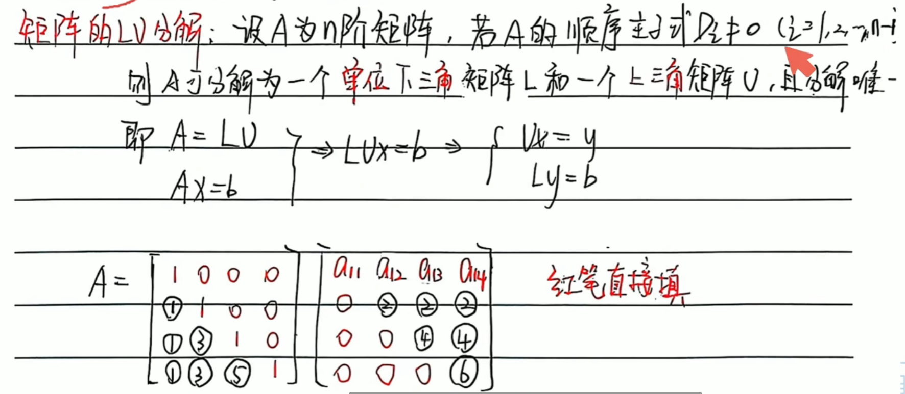

##### 参数间关系（最大有效拉力、初拉力、包角、摩擦因素）


##### 应力分析

带传动工作时，带中的应力有`拉应力`、`弯曲应力`、`离心拉应力`三种。


注意点：

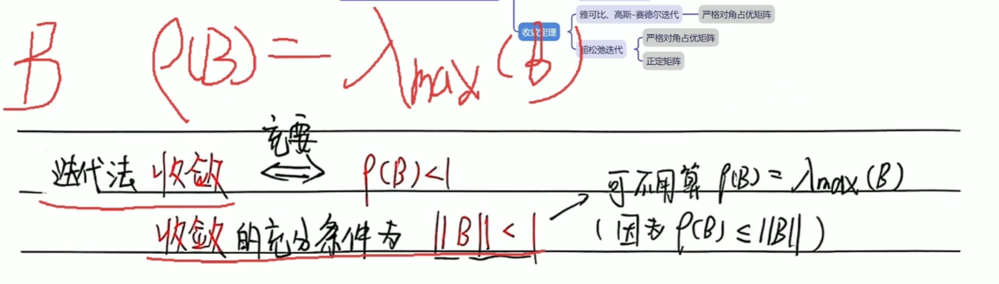
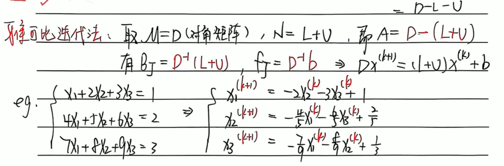
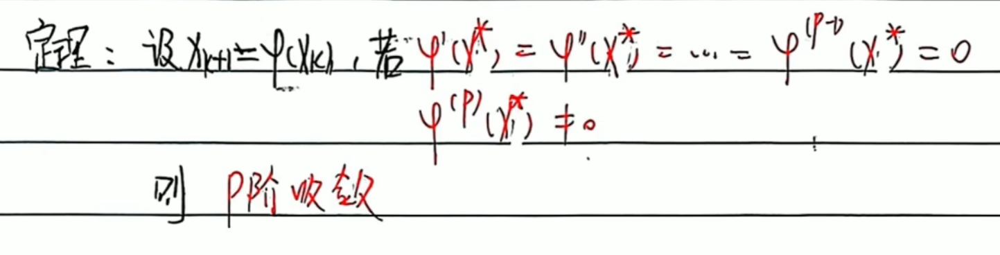
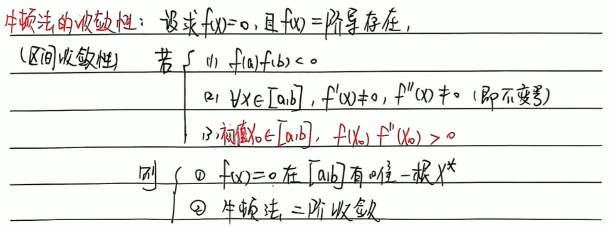
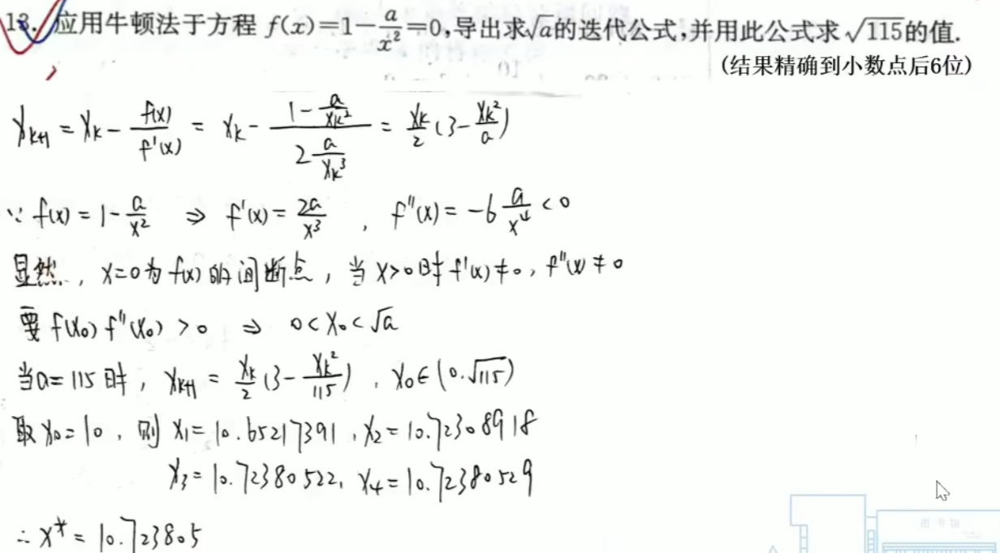

#### 失效分析（带的弹性滑动与打滑）

`弹性滑动`：带传动中因带的弹性变形变化所导致的带与带轮之间的相对运动，称为弹性滑动。
`打滑`：若带的工作载荷进一步加大，有效圆周力达到临界值𝑭_𝒆𝒄后，则带与带轮间会发生显著的相对滑动，即产生打滑。


#### 设计计算(普通𝑽带传动)

大概率不考，先不看

## 概率论与数理统计

### 事件的运算律（普通的就不提了）

#### 互斥与对立

`互斥`：

- 两个或两个以上的事件不能同时发生
- 若A、B、C三个事件互斥，则A∨B∨C=1-A∧B∧C

`对立`：

- 两个事件不能同时发生（且必定发生其中一个）

#### 德摩根律


### 古典概型

#### 古典概型的基本概念：等可能概型

### 条件概率

#### 条件概率的公式

>乘法公式

>
>贝叶斯公式


### 事件的独立性


---------------------------------------------------


### 离散型随机变量

#### 离散型随机变量的分布律

##### 0-1分布（贝努利分布）

##### 二项分布（n重伯努利试验）

>重要公式（计算每个随机变量的概率，高中学过）


##### 泊松分布（固定范围（时间or空间）内随机事件发生的次数的分布）

>重要公式


>泊松分布的逼近定理


##### 几何分布（第一次出现事件就停止）

>重要公式


| 0-1分布 | 二项分布 | 泊松分布 | 几何分布 |
|---------|---------|---------|---------|
|-------------|--------------------|--------------------|------------------|
| X~0-1(p)   X~B(1,p) | X~B(n,p)        | X~P(λ)   X~Π(λ)  | X~G(p)           |
|             | n：试验次数  p：成功概率 | λ：平均事件发生率(平均次数) | p：成功概率      |

#### 离散型随机变量的分布函数


### 连续型随机变量

#### 连续型随机变量的定义

求导如果均可就是连续型随机变量

#### 概率密度函数


`tip`:F(x)为连续性随机变量函数

#### 连续型随机变量的分布律

##### 均匀分布


>性质

其中可以看出，任意子区间，只要长度相同，概率就相等，*__可以被算出为常数__*

##### 指数分布


指数分布是无记忆性的，即具有恒定的概率函数


##### 正态分布


σ越小，概率越往中间集中


μ影响的是偏移值


>标准正态分布
μ=0,σ=1


| 均匀分布 | 指数分布 | 正态分布 |
|---------|---------|---------|---------|
| X~0-1(p)   X~B(1,p) | X~B(n,p)        | X~P(λ)   X~Π(λ)  |
|             | n：试验次数  p：成功概率 | λ：平均事件发生率(平均次数) |

| 分布类型       | 符号表示            | 参数描述                              |
|----------------|---------------------|---------------------------------------|
| 均匀分布       | X~U(a,b)  | p：成功概率,a:最小值,b:最大值                     |
| 指数分布       | X~exp(p)            | p：平均事件发生率                     |
| 正态分布       | X~N(μ, σ^2^)         | μ：均值, σ：标准差                  |

###### 中心分布定理

二项分布的极限就是正态分布
当二项分布的n,p趋于无穷大时，可用正态分布来近似。
当二项分布的p较小时，可用指数分布来近似。

###### 非标准正态的计算


###### 已知X的概率分布函数，求Y的概率分布函数(⭐⭐⭐)

>方法一：直接求(全局通用)

方法二：公式定理(__Y与X的关系函数一定要单调__)


### 多维随机变量及其分布

#### 二维离散型随机变量（同一维离散型，没啥区别）

变化：x     ->      (x,y)

##### 二维离散型随机变量的边缘分布律


##### 二维离散型随机变量的条件分布（同一维）

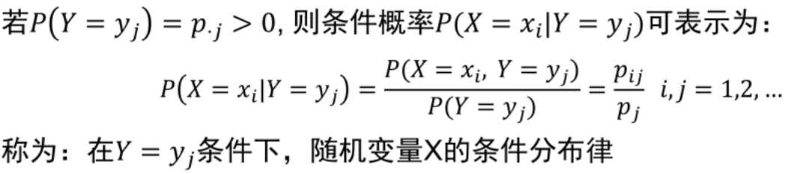

##### 二维离散型随机变量的分布函数（同一维）


#### 二维连续型随机变量

##### 二维离散型随机变量的（联合）概率密度（同一维）

后积先定限，限内划条线，先交是下限，后交是上限

##### 解题步骤

`举例`：
>


##### 二维离散型随机变量的边缘概率密度


##### 二维离散型随机变量的条件概率密度


## 电工电子技术

### 题型

1. 客观题（40分）
（1）填空（20分/一空一分）
（2）选择（20分/一空两分）
2. 主观题（60分）
（3）简答（20分/两题/分数不均分）
（4）计算（40分/三题）

### 基本放大电路

#### 基本放大电路的静态工作点分析

题目求静态工作点或静态参数即求电路中电容断路，电感短路后的I~b~：基极电流,I~c~：集电极电流,U~ce~：集电极和发射极之间电压差。

##### 静态工作点分析的具体题型

1. 基极电位不固定

    

2. 基极电位固定

    

#### 基本放大电路的动态工作点分析

##### 前置知识点

题目求动态工作点或动态参数即求电路中电容短路，电感断路，直流电压源短路（若没有直流电压源则输入端ui短路）后的 A~u~:放大倍数，R~i~:输出端等效电阻，R~o~:输入端等效电阻。

基础知识点r~be~计算方法，公式如下：


如何画微变等效电路？


##### 动态工作点分析的具体题型

1. 输出端接在集电极即共发射极放大电路`（基本上必考）`

    

2. 输出端接在发射极，即射级输出器动态电路（比较难，考的概率较小）

    

#### 选择题知识点

1. 共发射极放大电路 R~i~<R~o~,且有电流放大作用和电压放大作用。

2. 射级放大电路 R~i~>R~o~,且有电流放大作用但没有电压放大作用。


### 集成放大电路

#### 理想运放


#### 运算电路

1. 虚短：u~+~ = u~-~
2. 虚断：i~+~ = i~-~

例题：


#### 电压比较器

电压比较器工作在非线性区(`考试时不可以写成饱和区)`


例题：


### 反馈电路

#### 反馈电路的基本概念


开环放大倍数  A = X~o~ / X~i~', X~o~:输出量，X~i~':净输入量
反馈系数    F = X~f~ / X~o~ ,  X~o~:输出量，X~f~:反馈量
闭环放大倍数  A~f~ = A / 1+A*F,  A:开环放大倍数，F:反馈系数

例题：


## 数控加工

> 碎碎念:1.这门课选修,不选可以不看,但看了下推荐课表,好像也就这门课不算坑?
> 2.老师没发PPT,并且PPT很多内容杂鱼.我直接用书本上的重点知识来

### 期末考题目类型

1. 填空10个(20分)
2. 判断10个(10分)
3. 选择10个(20分)
4. 名词解释(5分)  -->听老师说1,2,3,4上课听了就很简单
5. 计算题(15分)  -->插补？
6. 编程题(30分)  -->分为两大类.数控车和铣任选一

> 1.数控车床-->考两类  
        (1)粗车循环和精车循环  
        (2)子程序
2.数控铣床 -->考两类  
        (1)  
        (2)钻孔循环(+攻螺纹)

### 所画重点
