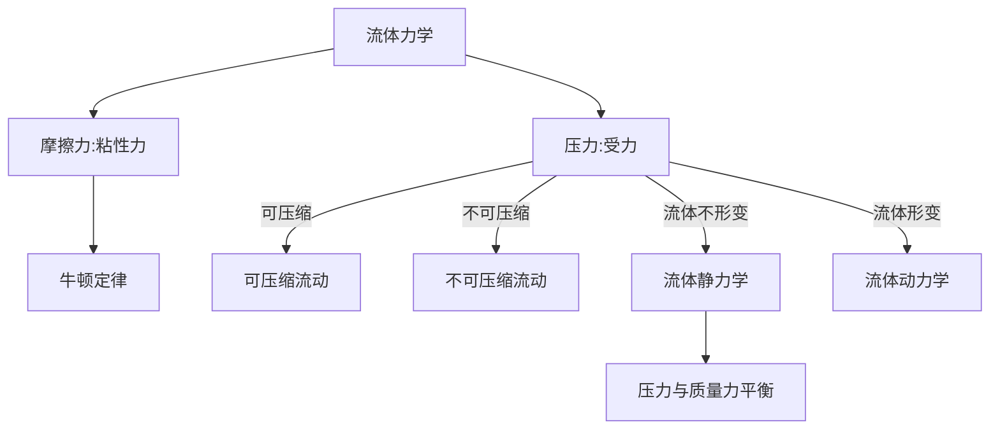
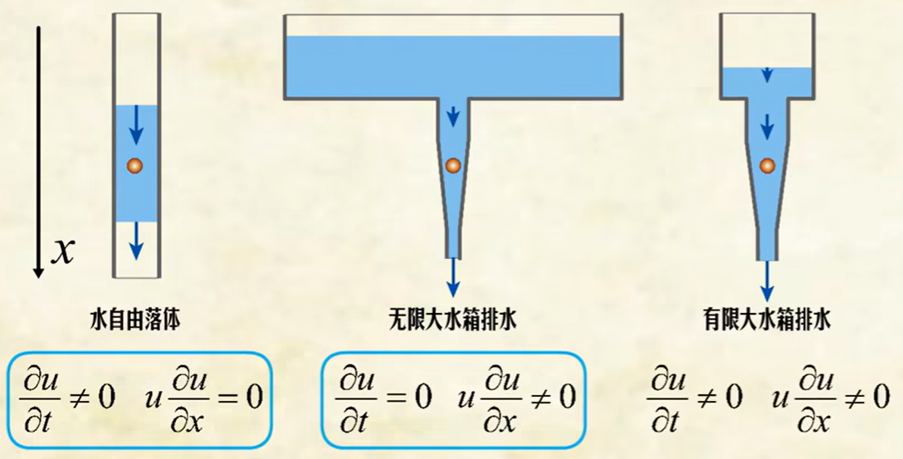
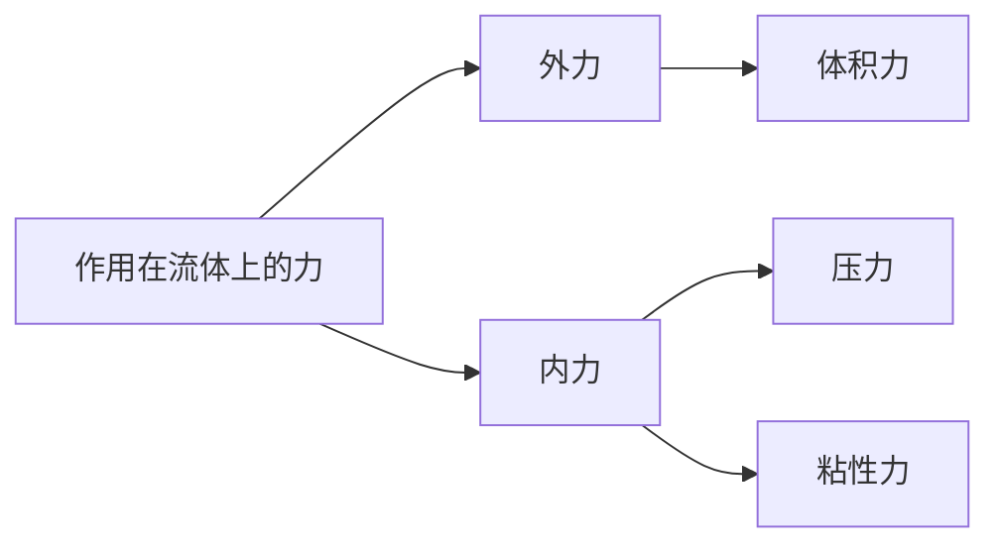

# 流体力学

## 基本概念

流体产生力的两种方式:`粘性力`和`压力`

### 粘性：与速度梯度成正比的“摩擦力”

- 牛顿粘性定理 $τ = μ \frac{∂u}{∂x}$
- 粘性系数 $μ$
- 运动粘度 $\nu = \frac{μ}{ρ}$

### 压缩性：受外界压力时体积减小的容易程度

- 易压缩性 $β = - \frac{1}{V} \frac{∂V}{∂p}$
- 体积弹性模量/不易压缩性 $K = \frac{1}{β}$

#### 可压/不可压流动(压力是否即刻传导)

- 声速:物体中**传递力的最大速度**$a=\sqrt{\frac{K}{ρ}}$
- 马赫数: 流体变化**较声速的程度**$M = \frac{U}{a}$

1. 不可压缩流动:流体变化慢,**流体受压时能跑掉**(流速<<流体热运动速度即`音速` $M<0.3$ )的流动
2. 可压缩流动:流体变化快,流体受压时跑不掉(流速接近流体热运动速度即`音速` $M>0.3$ )的流动

## 流体静(流体没有形变)力学

特点:压力与质量力(重力,惯性力,电磁力)平衡

1. 静止的流体内部没有剪切力->静止的流体流体中只有压力和质量力
2. 压力与方向无关->同样深度朝任何方向的压力相同

### 求解方法:压力和质量力平衡

- 参数:方向$x/y/z$,密度$ρ$,压强$p$
- 微分形式: $dp = ρ a_x \mathrm{d}x + ρ a_y \mathrm{d}y + ρ a_z \mathrm{d}z$

**欧拉平衡方程式**:

- 体积力:$\bm{K} = \bm{i}X+\bm{j}Y+\bm{k}Z$其中$\bm{i},\bm{j},\bm{k}$为单位向量

$$
\nabla p = \rho \bm{K}
$$

**特殊情况:压力和重力平衡**(即质量力只考虑重力):

- 参数:高度z,密度ρ,重力加速度g
- 微分形式(适用任意情况): $\partial p = ρ g \mathrm{d}z$
- 常规形式: $p = ρ g z$

## 流体的运动

### 研究方法

1. 拉格朗日法:研究质点的运动
2. 欧拉法:研究空间中定点的运动(流体力学一般使用这种)

#### 流线/迹线/脉线

- 流线:空间中每一点的速度**矢量图**
- 迹线:某质点在空间中运动的**轨迹图**,所以可相交
- 脉线:通过某固定点**质点连成的线**,也可相交

### 流体分类

#### 定常/非定常流动

- 定常流动:$\frac{\partial \vec{V}}{\partial t} \equiv 0$
- 非定常流动:空间某定点的速度变化:$\frac{\partial \vec{V}}{\partial t} \neq 0$

#### 均匀/非均匀流动

- 均匀流动:流体在空间中任意一点的速度都相同
- 非均匀流动:流体在空间中某一点的速度不相同

#### (估计不考)涡

- 自由涡:$ v_t \propto \frac{1}{r} $
- 强制涡$ v_t \propto r $

#### 层流/湍流

##### 雷诺数

- 截面平均流速$v$,管内径$d$,运动粘度$\nu$
- 雷诺数$Re = \frac{v d}{\nu}$

1. 层流:$Re < 2300$
2. 湍流:$Re > 4000$

### (估计不考)流体微团的运动:线变形,旋转,角变形,平动

待编写

## 流体加速度(流体压力/密度/温度的变化类比这个)

$\vec{a}=\frac{d \vec{V}}{d t} \\
=\frac{\partial \vec{V}}{\partial t}+\frac{\partial \vec{V}}{\partial x}\frac{\partial x}{\partial t}+\frac{\partial \vec{V}}{\partial y}\frac{\partial y}{\partial t} +\frac{\partial \vec{V}}{\partial z}\frac{\partial z}{\partial t}$

- 局部加速度:相对空间的加速度,定常流动当地加速度为0
  - $\frac{\partial \vec{V}}{\partial t}$
- 对流加速度:相对流体自身的加速度
  - $\frac{\partial \vec{V}}{\partial x}\frac{\partial x}{\partial t}+\frac{\partial \vec{V}}{\partial y}\frac{\partial y}{\partial t} +\frac{\partial \vec{V}}{\partial z}\frac{\partial z}{\partial t}$

例子:

### 物质导数(流体物理量的时间变化率)

$ \frac{D }{D t} =  \frac{\partial }{\partial t} + u \frac{\partial}{\partial x}+ v \frac{\partial}{\partial y}+ w \frac{\partial}{\partial z}$

## 质量守恒

### 连续方程式（准一维流动、定常、不可压缩）

- 准一维流动:只在一个方向上有速度变化的流动,(流管横截面积$A$变化)(必然不可压流动?)
- 流管横截面积$A$
- 流速$U$
- 体积流量$Q = A U$
- 控制体$CV$:研究的区域(空间中固定),质量守恒即流入和流出的体积流量相等

**连续方程:$Q_{in} = Q_{out} \\ A_{in}  U_{in} = A_{out}  U_{out}$**

### 质量守恒定理（准一维流动、定常、可压缩）

$ ρ_1 A_1 U_1 = ρ_2 A_2 U_2 $

**更普适的表达式**:$\frac{\partial m_{cv}}{\partial t} = \dot m_{in} - \dot m_{out}$(定常流动左边=0)

## 动量定理

### 作用在流体上的力

### 不可压缩流体的动量方程

**对于不可压缩流体**($\frac{D p}{D t} = \partial p/\partial t + (\bm{v} \cdot \nabla)ρ = 0$):
有柯西运动方程。
$$
质量 * 加速度 = 外力 + 压力 + 粘性力 \\
ρ \frac{D \bm{v}}{D t} = ρ \bm{F} + \nabla p + \nabla \cdot \bm{\tau}
$$

#### 纳维尔-斯托克斯方程

由本构方程式$\bm{\tau}=μ \dot \gamma$,柯西方程式可写作

**纳维尔-斯托克斯方程**:
$$
ρ \frac{D \bm{v}}{D t} = ρ \bm{F} - \nabla p + μ \nabla^2 \bm{v}
$$
在一般的流体力学问题中外力通常为重力,若取重力作用方向为沿$z$轴向下,满足$ρ \bm{F} = ρ \nabla (-gz) = - ρ g \bm{k}$。因此重力的作用可**包含在压力中**,重新定义$p=p+ρgz$则有
$$
ρ \frac{D \bm{v}}{D t} = \nabla p + μ \nabla^2 \bm{v}
$$

#### NS方程式的近似解

##### 无量纲化

- 无量纲化:将物理量的单位统一,使其具有相同的数量级,方便比较

用长度\速度\时间作为**特征量**

- 特征长度$L$
- 特征速度$U$
- 特征时间$L/U$

定义下述**无量纲数**:

$$
x^* = \frac{x}{L} \\
y^* = \frac{y}{L} \\
z^* = \frac{z}{L} \\
v_x^* = \frac{v_x}{U} \\
v_y^* = \frac{v_y}{U} \\
v_z^* = \frac{v_z}{U} \\
t^* = \frac{t}{L/U}   \\
p^* = \frac{p}{\rho U^2 / 2} \\
$$

结合$Re=ρUL/μ$可得
$$
\frac{D\bm{v}^*}{Dt^*}= - \nabla^* p^* + \frac{1}{Re} \nabla^{*2} \bm{v}^*
$$

##### 斯托克斯近似

### 贝努利方程（无粘、不可压缩流体的动量方程）

**适用情况**:无粘、不可压缩流体,绝热,没有输入功

**贝努利方程**:

$ \frac{p_1}{ρ} + \frac{U_1^2}{2} + g z_1 = \frac{p_2}{ρ} + \frac{U_2^2}{2} + g z_2 = C(常数)$

## 能量守恒
