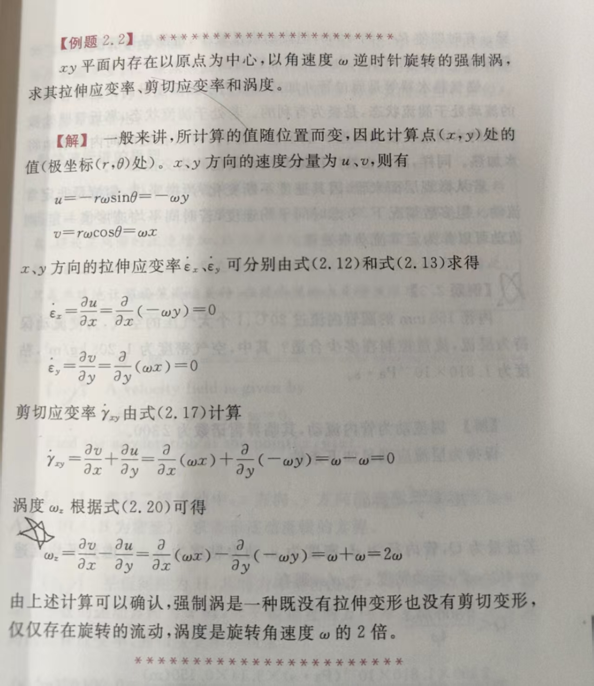
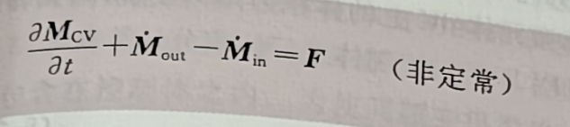
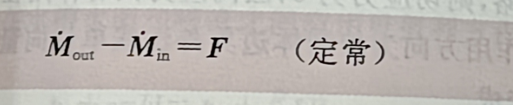

# 流体热工考试内容

## 流体的性质和分类

### 流体的基本性质

- 粘度$\mu$
- 牛顿粘性定理$\tau=\mu \frac{\mathbf{d} u}{\mathbf{d} y}$
- 运动粘度$\nu = \frac{\mu}{ρ}$

### ⭐流体的分类

#### 粘性流体$\mu ≠ 0$和非粘性流体$\mu = 0$

## 流体流动基础

### 两种研究流体运动的方法

- 拉格朗日描述方法:所谓拉格朗日描述方法是指着眼于某个流体粒子,追踪其运动轨迹,研究位置、速度和压力等变化的方法。$v(t;x_0,y_0,z_0,t_0)$
- 欧拉描述方法:固定观测点,研究通过观测点的流体的速度和压力。$v(x,y,z,t)$

### 流线脉线迹线

- 流线:是指某一瞬间的速度矢量的包络线,即平滑地连接各点速度矢量的线,在各点上速度矢量和流线方向一致。
- 脉线:是指通过空间内某固定点的流体质点连成的线。
- 迹线:是指某个流体粒子流过的路线。

### 流体的加速度和物质导数

$$
\vec{a}=\frac{d \vec{V}}{d t} \\
=\frac{\partial \vec{V}}{\partial t}+\frac{\partial \vec{V}}{\partial x}\frac{\partial x}{\partial t}+\frac{\partial \vec{V}}{\partial y}\frac{\partial y}{\partial t} +\frac{\partial \vec{V}}{\partial z}\frac{\partial z}{\partial t}
$$

- 局部加速度:相对空间的加速度,定常流动当地加速度为0
  - $\frac{\partial \vec{V}}{\partial t}$
- 对流加速度:相对流体自身的加速度
  - $\frac{\partial \vec{V}}{\partial x}\frac{\partial x}{\partial t}+\frac{\partial \vec{V}}{\partial y}\frac{\partial y}{\partial t} +\frac{\partial \vec{V}}{\partial z}\frac{\partial z}{\partial t}$

$$
\frac{D }{D t} =  \frac{\partial }{\partial t} + u \frac{\partial}{\partial x}+ v \frac{\partial}{\partial y}+ w \frac{\partial}{\partial z}
$$

### 定常流动和非定常流动

- 定常流动：不随时间变化的流动。
- 非定常流动：随时间变化而变化的流动。

### 涡

- 自由涡：是流体的周向速度v反比于其距旋转中心半径r的流动,该涡产生时没有外部能量的输人。
- 强制涡：是流体周向速度v正比于旋转半径r的旋转流动,有外部能量的输人。

### 层流和湍流

#### 雷诺数

$$
Re=\frac{v d}{\nu}
$$

### 层流(Re<2300)

### 转捩区域(2300 < Re < 4000)

### 湍流(Re>4000)

## 流体静力学

### 静止流体中的压力

1. 无剪切应力
2. 各向同性:静止流体中任意一点上的压力在任何方向上均相等，压力为位置的函数。(静止流体中的压力是仅与位置相关的函数,也就是点函数)

### 贝努利方程

$$
\frac{p_1}{g ρ} + \frac{U_1^2}{2 g} + z_1 = \frac{p_2}{g ρ} + \frac{U_2^2}{2 g} + z_2 = C(常数)
$$

左边第一项称为**压力水头**(pressure head),第二项称为**速度水头**。(velocity head),第三项称为**位置水头**(potential head)。它们的总和称为总水头(total head)。

## 动量定理

### 动量方程

非定常

定常

## 管内流动

### 损失种类、类型

